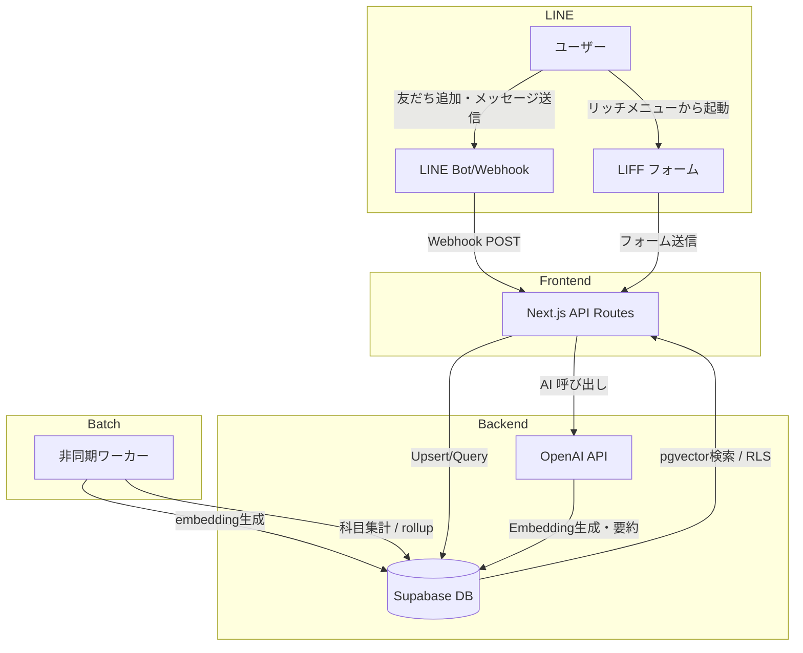

# 追記：現状アップデート（2026-01-14 JST）

> **このファイルは「元のまとめ（report.md）」をそのまま残し、**  
> “明らかに古くなった運用情報”だけを上書きするための追記（パッチ）を冒頭に付けた版です。  
> 目的：Codex/共同開発者/先生が **今の稼働構成**を誤解しないようにする。

## 変更点サマリー（元文書からの差分）

### GitHub（統合）
- 2つのGitHub管理 → **モノレポ1本に統合**
  - Repo: `lego0509/campus-ai`

### Vercel（確定した運用）
- **Vercelプロジェクトは2つ**（Root Directory固定）
  - Project A（review / Next.js）Root: `apps/review-page`  
    - Production: `https://campus-ai-eight.vercel.app`
  - Project B（line / webhook）Root: `apps/line-ai-bot`  
    - Production: `https://line-liart.vercel.app`

### LINE → 応答の経路（A構成で統一）
- Webhook: `https://line-liart.vercel.app/api/webhook`
- Ask API: `https://campus-ai-eight.vercel.app/api/ask`
- line側は **必ず** `ASK_API_URL` 経由で review の `/api/ask` に投げる（AI中核はreview側に集約）

### 現状の最優先課題
- 「DB検索して回答に反映」がまだ不安定  
  → `/api/ask` に `ASK_DEBUG=1` 時の **used_db / db_hits / evidence** などの可視化を入れるのが最優先（原因切り分けが可能になる）

---

## 追加：環境変数（実運用の最低限）

### 共通（両方で一致必須）
- `SUPABASE_URL`
- `SUPABASE_SERVICE_ROLE_KEY`（サーバのみ）
- `LINE_HASH_PEPPER`

### review（apps/review-page）
- `OPENAI_API_KEY`
- `BATCH_TOKEN`
- `NEXT_PUBLIC_LIFF_ID`
- 任意：`ASK_DEBUG=1` / `NEXT_PUBLIC_DEV_LINE_USER_ID`

### line（apps/line-ai-bot）
- `LINE_CHANNEL_SECRET`
- `LINE_CHANNEL_ACCESS_TOKEN`
- `ASK_API_URL=https://campus-ai-eight.vercel.app/api/ask`
- 任意：`ASK_TIMEOUT_MS=45000` / `DEBUG_WEBHOOK=1`

---

## 追加：スモークテスト（最小）
- `GET https://line-liart.vercel.app/api/webhook` → `{"message":"LINE Bot running"}`
- LINEでメッセージ → 返信が来る
- `POST https://campus-ai-eight.vercel.app/api/ask` がenv不足で落ちない

---

## 追加：GitHub Actions（バッチ定期実行）
- ワークフロー: `.github/workflows/batch-jobs.yml`
- 10分ごとに `POST /api/batch/embeddings/run` と `POST /api/batch/rollups/run` を実行
- GitHub Secrets: `BATCH_TOKEN`
- GitHub Variables（任意）: `REVIEW_BASE_URL`（未設定なら `https://campus-ai-eight.vercel.app`）

---

# ここから下は「元のまとめ（report.md）」を原文のまま保持

# 卒業研究：システム開発まとめ（現状版）

この文書は、アップロードされた卒業研究チャット（00–14）のうち、タイトルが「卒業研究」で始まる会話のみを読み取り、技術的な内容を抽出・再構成したものです。個人的な雑談や感情的な部分は省き、システム設計と実装に関わる情報だけをまとめています。ソースとなったチャット番号は本文中に `(source: 卒業研究XX)` の形式で記載しています。

## サマリー（現状）

### 何を作っているか

大学向けの **LINE チャットボット型レビュー／QA システム** を開発している。学生は LIFF フォームから授業や企業に関するレビューを投稿し、その内容を **Supabase**（PostgreSQL＋pgvector）に保存する。保存されたレビューやユーザーの会話履歴は **OpenAI の API** を用いて要約・Embedding 化され、類似度検索を通じて次回の応答に活用される。フロントは **Next.js + LIFF**、バックエンドは **Next.js API Routes と Supabase Edge Functions** を組み合わせ、デプロイは **Vercel** が基本となる。

### できていること

- **DB 設計**：匿名レビュー／AI 要約に最適化したスキーマがほぼ確定。主なテーブルは `users`、`user_affiliations`、`universities`、`subjects`、`teachers`、`course_reviews`、`course_review_embeddings`、`course_review_ai_flags`、`user_memory`、`chat_messages` 等。
- **匿名性設計**：LINE のユーザーIDはそのまま保存せず、サーバ側で **salt/pepper 付き HMAC** で不可逆ハッシュ化した値 (`users.line_user_hash`) を保存する方針に決定。
- **1ユーザー＝1スレッド方針**：チャットはスレッド分割せず、`chat_messages` に `user_id`・`role`・`content`・`created_at` を保存する構成に統一。`conversations` テーブルは不要になった。
- **不要なテーブルの削除**：表示名やアイコンをDBに保持しないため `user_profiles` テーブルを削除。`*_extra` のような将来用テーブルは新規作成せず、本体＋AI用テーブルだけに絞る方針。
- **レビュー投稿フローの確立**：ユーザーがレビューを投稿する際にどのテーブルへ何が入るか、マスタの upsert からレビュー本体・Embedding までの時系列フローが整理された。
- **RLS／インデックス設計**：ユーザ自身のみが自分のチャットログと要約を読み書きできるよう Row Level Security を前提にし、`chat_messages(user_id, created_at)` に複合インデックスを付けるなど基本的なチューニングも確認済み。

### まだできていないこと

- **UI 実装**：LIFF フォーム・LINE リッチメニューおよび Next.js 管理画面の実装は初期段階で、画面遷移やバリデーションが未完成。マークアップは仮で構わないが入力項目は確定している。
- **非同期処理／バッチ**：レビュー保存後に行う Embedding 生成、要約更新、科目別集計 (`subject_rollups`) などの非同期処理は設計のみで具体的なワーカやキューの実装が未着手。
- **RAG（外部知識検索）**：現状は会話履歴を保持する「会話メモリ型チャット」で、RAG 的にレビュー本文を Embedding 検索して回答に組み込む機能はまだ無い。
- **企業レビュー機能**：授業レビューを優先するため、企業レビュー (`companies`、`company_reviews` 等) に関する実装は後回しにしている。
- **退会・削除フロー**：LINE 友だち削除時にユーザーを退会扱いするか、データを論理削除するか等の運用設計が未確定。

### 直近の優先タスク

| Priority | タスク | 説明 |
|---|---|---|
| **P0** | ユーザー登録基盤の完成 | LIFF から取得した `lineUserId` をハッシュ化し、`users` と `user_affiliations` に upsert する部分を実装する。|
| **P0** | レビュー投稿→DB保存→AI 処理が一往復する MVP | 入力フォームからレビューを送信し、DBに保存して Embedding/要約を生成し、AI で応答を返す流れまでを動かす。|
| **P1** | 会話履歴の保存と参照 | `chat_messages` にメッセージを保存し、直近 N 件＋`user_memory.summary_1000`を取得してプロンプトに利用できるようにする。|
| **P1** | RLS ポリシーの実装 | `chat_messages`、`user_memory`、`course_reviews` 等でユーザー自身のみが閲覧・更新できるように Supabase の Row Level Security を定義する。|
| **P2** | バッチ処理基盤 | Embedding 更新や `subject_rollups` 集計を非同期で実行する仕組み（CRON やキュー）の選定と実装。|
| **P2** | 管理者画面 | Next.js で簡易な管理 UI（レビュー一覧の閲覧、AI フラグ確認など）を作成する。|
| **P2** | 企業レビュー機能 | 授業レビューと同様のフローで企業レビューを取り扱うテーブル・API・UI を追加。|

## 全体像

### アーキテクチャ（フロント/バック/DB/LLM/バッチ）

以下は現時点の簡易的なアーキテクチャ図である。Next.js アプリは Vercel にデプロイされ、フロントの LIFF アプリとバックエンドの API Routes/Edge Functions を兼ねる。Supabase は Postgres とオブジェクトストレージ、Auth を提供し、AI 呼び出しに必要なサービスキーはバックエンド側のみが参照する。

### データフロー

レビュー投稿とチャット応答のフローは次の通り：

1. **LIFF で識別**：LIFF アプリで `lineUserId` を取得し、サーバ側で pepper 付き HMAC でハッシュ化。`users` テーブルへ upsert する。
2. **マスタ upsert**：大学 (`universities`)、科目 (`subjects`)、ユーザー所属 (`user_affiliations`) を名前ベースで検索し、存在しなければ作成する。
3. **レビュー保存**：`course_reviews` にレビュー本文やスコアを保存し、教師名は手入力のまま `teacher_name_raw` に保存する。`teacher_id` は後から正規化できるよう nullable とする。
4. **Embedding & AI フラグ生成**：レビュー本文を OpenAI の Embedding API に送信し、ベクトルを `course_review_embeddings` に保存する。同時に、フィルタリングやカテゴリ分けなど AI フラグを `course_review_ai_flags` に保存する。
5. **会話メモリ更新**：ユーザーがチャット経由で質問した場合、`chat_messages` にメッセージを保存し、直近 N 件＋ `user_memory.summary_1000` を組み合わせて LLM に投げる。一定件数に達したら要約を更新して `user_memory` に保存する。
6. **応答生成**：LLM から返ってきた応答を LINE に返信し、応答内容を `chat_messages` に保存する。

## 要件・ユースケース（現状）

### 主なユースケース

| ユースケース | 説明 |
|---|---|
| **授業レビュー投稿** | ユーザーは LIFF フォームで大学・学部・学科・学年・科目名・教師名（手入力）・難易度・満足度・感想本文を入力し送信する。初回投稿時には大学・学部・学科・学年・所属情報が `universities` と `user_affiliations` に追加され、レビューが `course_reviews` に保存される。|
| **レビュー要約取得** | 投稿済レビューに対し AI が要約やキーフレーズを生成し、Embedding と一緒に保存する。ユーザーは後日「この授業は楽しい？」等の曖昧な質問を投げると、類似 Embedding からレビューを検索し要約を返してもらえる（将来的に RAG へ拡張）。|
| **会話型質問応答** | LINE ボットとの会話の中でユーザーが質問すると、`chat_messages` に保存された過去の対話と `user_memory.summary_1000` を元に LLM が応答を生成する。直近 20 件程度の履歴を使い、長期的な記憶は要約に蓄積する。|
| **管理者によるレビュー確認** | 管理者は Next.js 管理画面からレビュー一覧や AI フラグを閲覧し、不適切レビューの削除や教師名の正規化を行う。|

### 非機能要件

* **匿名性**：LINE のユーザーIDはハッシュ化し、生レビューには投稿者名を表示しない。プロフィール画像や表示名は都度 LINE API から取得する方針とし、DB には保存しない。
* **1ユーザー=1スレッド**：会話はスレッド分割せず、`chat_messages` に時系列で保存する。`conversations` テーブルは不要。
* **AI を利用した要約/分類**：レビュー本文は Embedding 化し、将来的に似たレビュー検索や傾向分析に活用する。チャットメモリは要約 (`user_memory.summary_1000`) で管理し、毎回の応答では直近ログと要約のみを参照する。
* **スケーラビリティとコスト**：Embedding/API 呼び出しは OpenAI の GPT‑4o mini 等を用い、1 回あたり 0.0003–0.0004 USD 程度のコスト見積もり。想定利用人数でも 10 USD 程度で収まる。
* **セキュリティ**：個人情報や機密情報は AI API に送らない。送信前にマスキング処理を挟み、Supabase 内では匿名化 ID で管理することが基本方針。

## データ設計（現状）

匿名性を保ちつつレビューと会話を管理するため、スキーマは必要最小限に絞っている。主なテーブルと役割をまとめる。

| テーブル | 主なカラム / 説明 |
|---|---|
| **users** | `id` (PK), `line_user_hash` (不可逆ハッシュ, UK), `created_at`。生の LINE userId は保存しない。 |
| **user_affiliations** | `id` (PK), `user_id` (FK), `university_id` (FK), `faculty`, `department`, `grade`, `enrollment_year`, `is_active`, `created_at`。ユーザーの所属情報を固定する。 |
| **universities** | `id` (PK), `name`, `created_at`。大学名のマスタ。 |
| **subjects** | `id` (PK), `university_id` (FK), `name`, `created_at`。科目名のマスタ。 |
| **teachers** | `id` (PK), `university_id` (FK), `name`, `created_at`。同姓同名問題に対応するため、大学ごとに教師をスコープする。 |
| **course_reviews** | `id` (PK), `subject_id` (FK), `user_affiliation_id` (FK), `teacher_name_raw` (手入力文字列), `teacher_id` (nullable FK), `difficulty_score`, `satisfaction_score`, `body_main`, `created_at`。レビュー本体。 |
| **course_review_embeddings** | `review_id` (PK/FK), `embedding` (vector型), `created_at`。レビュー本文の Embedding を格納。 |
| **course_review_ai_flags** | `review_id` (PK/FK), `ai_flagged` (bool), `category`, `severity` (numeric), `raw_json`, `created_at`。AI によるカテゴリ判定やセンシティビティを保存。 |
| **user_memory** | `user_id` (PK/FK), `summary_1000` (テキスト, 1000文字程度), `last_summarized_at`。直近ログを要約した長期メモリ。 |
| **chat_messages** | `id` (PK), `user_id` (FK), `role` (user/assistant/system), `content`, `created_at`。チャットのメッセージを時系列で保存する。インデックス `(user_id, created_at)` を付ける。 |
| **subject_rollups** (予定) | `subject_id` (PK/FK), `summary` (テキスト), `review_count`, `avg_satisfaction`, `avg_difficulty`, `updated_at`。科目ごとの集計結果と要約を保存するためのバッチ出力テーブル。 |
| **companies / company_reviews / company_review_embeddings** | 企業レビュー機能用。授業レビューと同じ構造で、企業に対するレビューや Embedding を保存する。現状は実装を後回しにしている。 |

この他、将来用の `*_extra` テーブルは当面作らない。`teachers` と `subject_teachers` の中間テーブルは、一旦廃止し `teacher_name_raw` + `teacher_id (nullable)` の組み合わせで同姓同名問題に備える。

## API 設計（現状）

Next.js の API Routes ないし Edge Functions を用いて以下のようなエンドポイントを想定している。例示するパスや戻り値はあくまで現状の案であり、実装時に変更される可能性がある。

| Method & Endpoint | 説明 | 主な入力 | 主な出力 |
|---|---|---|---|
| `POST /api/liff/login` | LIFF から送信される `lineUserId` を受け取り、`users` を upsert して `user_affiliations` を返す。後続のフォームで利用する。 | `{ lineUserId: string, faculty?, department?, grade?, enrollmentYear? }` | `{ userId, affiliationId }` |
| `POST /api/reviews` | 授業レビューを受け取り、`course_reviews` に保存。マスタ (university, subject) を upsert し、非同期で Embedding と AI フラグを生成する。 | `{ userId, universityName, faculty, department, grade, subjectName, teacherNameRaw, difficultyScore, satisfactionScore, bodyMain }` | `{ reviewId }` |
| `POST /api/chat` | LINE Bot や LIFF からのメッセージを受け取り、`chat_messages` に保存し、直近ログと要約を使って LLM に応答を生成する。 | `{ userId, message }` | `{ replyMessage, updateSummary?: boolean }` |
| `POST /api/webhook` | LINE Webhook を受け取り署名検証後、`POST /api/chat` を内部呼び出しする。Vercel では `bodyParser` を無効にして raw body を扱う必要がある。 | LINE からのイベント JSON | HTTP 200/400 |
| `GET /api/subjects/:universityId` | 科目一覧を取得する。 | `universityId` | `[ { id, name } ]` |
| `GET /api/reviews/search` (予定) | Embedding 検索用。ユーザーの質問を Embedding 化し、類似のレビューを上位 K 件返す。 | `{ queryText: string, topK: number }` | `[ { reviewId, score, summary } ]` |

## バッチ・非同期処理（現状）

レビュー投稿後すぐに Embedding 生成や科目別集計を行うと Webhook の処理時間が延びてしまう。現状の方針では **非同期ワーカー**（Supabase Edge Functions や外部のキュー／CRON サービス）を使って以下の処理を行う：

1. **Embedding 生成バッチ**：`course_review_embeddings` に Embedding が無いレビューを定期的に取得し、OpenAI Embedding API でベクトルを生成して保存する。1 行ごとにベクトルを計算するためバッチ単位で実行する。
2. **AI フラグ付与バッチ**：レビュー本文に対するカテゴリ分けやセンシティブ判定を行い、`course_review_ai_flags` を更新する。コストが高い場合は mini モデルを使い、重度の表現だけを検出する。
3. **subject_rollups 更新バッチ**：科目ごとにレビュー数・平均点・要約を集計し `subject_rollups` に書き込む。ユーザーが「楽しい授業」「おすすめの授業」など曖昧質問をした際には、この rollup を検索し素早く回答できるようにする。
4. **user_memory 要約更新バッチ**：`chat_messages` の差分件数が閾値（例：20件）を超えたら、LLM で直近ログを要約し `user_memory.summary_1000` を更新する。これにより長期的な会話文脈を維持する。

バッチ処理は Vercel で長時間ジョブが苦手なため、必要に応じて Supabase Edge Functions や別のサーバ（例：Fly.io、Cloud Run）で実行することを検討する。処理ごとにリトライやロック機構を入れ、重複実行やレースコンディションを避ける必要がある。

## 検索/LLM連携（現状）

会話メモリ型のチャットは次のステップで構成される：

1. ユーザーの質問を受け取り `chat_messages` に保存する。
2. `user_memory.summary_1000` と `chat_messages` の直近 N 件を取り出し、プレフィックスプロンプトと組み合わせて LLM に送る。
3. LLM から生成された応答を保存し、LINE に返信する。
4. `chat_messages` の件数が閾値に達した場合、差分部分を LLM で要約して `user_memory.summary_1000` を更新する。

現状は会話ログだけを検索対象にしているため「Retrieval」部分は限定的で、一般的な RAG（知識ベース検索＋回答生成）ではない。将来的には `course_review_embeddings` を近傍検索して関連レビューを取り出し、質問回答の補助に使う予定。その際は Embedding を正規化し、ユーザーの質問も Embedding 化して Top-K 検索を行う関数を Supabase 上に実装する。

## 実装メモ（現状）

* **Next.js / LIFF**：フロントは Next.js と LIFF SDK を利用。開発中は `userId` を固定のダミー値とし、完成後に LIFF から取得した値に差し替える開発フローが推奨されている。
* **Vercel デプロイ**：Next.js の API Routes は短時間の処理に向いており、LINE Webhook の raw body を扱う場合は `bodyParser` を無効にして署名検証を行う必要がある。Embedding 生成や近傍検索を同期的に行うとタイムアウトの原因になるため、重い処理はバッチへ移す。
* **Supabase クライアント**：サーバ側では `supabase-js` を service key で初期化し、RLS をバイパスして挿入／更新を行う。クライアント側（LIFF）では公開鍵で初期化し、RLS ポリシー下で自分のデータのみ読み取れるようにする。
* **RLS 設定**：`users`、`user_affiliations`、`chat_messages`、`user_memory` 等は `line_user_hash = auth.uid()` による Row Level Security を設定する。サービスキーを使うサーバサイド処理では RLS を無効にし、`user_id` を正しく指定することが重要である。
* **インデックス**：`chat_messages(user_id, created_at)` の複合インデックスを必ず作成し、直近ログの取得や要約対象件数の集計が高速に行えるようにする。
* **教師名の扱い**：手入力の教師名は `course_reviews.teacher_name_raw` に保存し、`teachers` テーブルに正規化するのは任意とする。同姓同名・表記ゆれに対応するため、完全一致にこだわらず候補が複数ある状態を表現できる設計にする。
* **DB 破壊時の対処**：大きく設計変更する場合は Supabase の public スキーマを丸ごと削除して作り直すのが安全。`drop schema public cascade; create schema public;` を実行し、権限を再設定する。
* **予算試算**：GPT‑4o mini を使った場合、1回あたり 0.0003〜0.0004 USD 程度で、9,000 回程度の利用でも 10 USD 以下に収まる見積もりが示された。

## トラブルシューティング

| 問題 | 原因 | 解決 | 再発防止 |
|---|---|---|---|
| **Webhook の検証に失敗し署名エラーが出る** | Vercel の API Routes が自動で body を JSON 化してしまい、LINE の署名検証に必要な raw body が取得できない。 | API Route で `bodyParser: false` を設定し、`req.rawBody` を使って署名を検証する。 | Next.js の設定にデフォルトで `bodyParser: false` を明示し、テストを継続する。 |
| **embedding 生成が遅くタイムアウトする** | Vercel の 10 秒制限に対して、Embedding API 呼び出しや近傍検索を同期で実行している。 | Embedding の生成・保存を非同期バッチに切り出し、Webhook 処理ではレビュー保存だけを行う。 | Vercel で長時間処理を避ける設計方針を徹底し、ログで処理時間を計測して対策する。 |
| **会話履歴が肥大化し応答が遅くなる** | `chat_messages` の件数が増えると毎回のプロンプトが長大になり、コストも上がる。 | 直近 N 件のみを取得し、過去のログは定期的に要約して `user_memory.summary_1000` に保存する。 | 閾値 (例:20 件) を超えたら要約を生成するロジックを実装し、プロンプト長を一定に保つ。 |
| **ユーザーの所属や大学名が重複する** | マスタテーブルへ入力値の重複チェックをしないまま upsert している。 | `universities.name`、`subjects.name` にユニーク制約を追加し、`insert ... on conflict (name) do nothing` で upsert する。 | 必要最低限のユニーク制約を設定し、後から変更する際はマイグレーションを用意する。 |

## 決定事項ログ（Decision Log）

| 変更前 → 変更後 | 決まったタイミング / ソース |
|---|---|
| **`user_profiles` テーブルで表示名・アイコンを保持する案** → **プロフィールは都度 LINE から取得し、テーブルごと削除** | 卒業研究07/08 で匿名性を徹底する方針が固まり、`user_profiles` を削除する ER 図が提示された。|
| **`conversations` テーブルでスレッド管理** → **1ユーザー＝1スレッド運用に統一、`chat_messages` に `user_id` を直持ち** | LINE の特性上スレッド分割が不要であることが確認され、スキーマを簡略化する決定がなされた。 |
| **LINE userId をそのまま保存** → **塩と pepper を使って HMAC ハッシュ化し、`users.line_user_hash` に保存する方式** | 個人情報保護と匿名性の観点から、不可逆ハッシュを採用する方針が確定した。|
| **先生・科目の正規化を subject_teachers 中間テーブルで管理** → **手入力した `teacher_name_raw` をレビューに保存し、`teacher_id` は nullable、`subject_teachers` を一旦削除** | 同姓同名や表記ゆれを柔軟に扱うため、中間テーブルを廃止して後から正規化可能な設計に変更。|
| **レビューごとに全ての付随テーブル (`*_extra` 等) を事前に用意** → **embedding と AI フラグ以外の将来用テーブルは当面作らない** | 機能を絞って MVP を完成させる方針が示され、後から必要に応じて追加することになった。|
| **ユーザー登録をLINEのfollowイベントのみで行う案** → **LIFF起動時にハッシュを作成し upsert、followはオプション扱い** | 認証フローのズレを解消し、会話との結合を簡潔にするために決定された。|
| **会社レビュー機能を授業レビューと同時に実装** → **授業レビューを優先し、企業関連テーブル・機能は後回し** | Scope creep を防ぎ、卒研期間内に完成度を上げるための方針変更。|

## 未確定点・リスク・質問リスト（先生/共同開発者向け）

1. **退会・データ削除の扱い**：LINE 友だち削除や退学時にユーザーのデータをどの程度削除するか（物理削除／論理削除／匿名化）を決める必要がある。
2. **教師・科目の名寄せ**：`teacher_name_raw` を正規化する運用は未確定。同姓同名や表記ゆれが増えた場合のマージ手順を検討する。`teachers` に大学をスコープする案はあるが、複数キャンパスや年度差分への対応は要検討。
3. **RAG への拡張方法**：Embedding 検索を用いた本格的な RAG を導入する場合、Supabase での類似検索関数やプロンプト設計の方針を決める必要がある。どのタイミングで実装するかも未定。
4. **非同期処理基盤の選定**：Vercel Functions だけで完結するのか、Supabase Edge Functions や他サービスを利用するのかまだ決まっていない。長時間ジョブに対する戦略を整理する必要がある。
5. **ユースケースの拡大**：企業レビュー機能や学科別ランキング、集計グラフなどの追加機能をいつ実装するか、優先順位を明確にする。
6. **認証の強化**：現在は LIFF の `getLineUserId()` を使う前提だが、将来的に OpenID Connect を利用した厳格な認証が必要かどうかを検討する。

## TODO / 今後の計画

### 優先度別タスクリスト

#### P0（今すぐ着手）
1. `users` と `user_affiliations` の upsert 実装を完了し、LIFF からサーバへトークンを送信してハッシュ化する処理を動かす。
2. 授業レビュー投稿フォーム（LIFF）の MVP を作成し、Next.js API Route 経由で `course_reviews` に保存する。
3. `chat_messages` の書き込みと参照機能を実装し、直近ログと `user_memory.summary_1000` を LLM に渡して応答を生成する流れを構築する。

#### P1（基盤が整い次第）
1. Supabase の RLS ポリシーを本番環境用に作成し、`user_id` または `line_user_hash` に基づいてアクセス制御を徹底する。
2. Embedding 生成バッチと AI フラグ付与バッチの実装を開始し、レビュー保存直後に即座に生成するのではなく、非同期に処理するようにする。
3. 管理者画面（Next.js）の初期版を作成し、レビュー一覧・AI フラグの可視化、教師名の正規化ツールなどを提供する。

#### P2（余裕が出てきたら）
1. `subject_rollups` の生成バッチと検索 API を実装し、「楽しい授業」「おすすめの授業」等の質問に対して集計値を返せるようにする。
2. 企業レビュー機能の実装：`companies`、`company_reviews`、`company_review_embeddings` 等のテーブルと API を追加し、授業レビューと共通化できる部分を抽象化する。
3. RAG 検索の導入：Embedding 検索関数を Supabase に実装し、ユーザーの質問をベクトル化して類似レビューを取得する処理を組み込む。
4. UI/UX 改善：リッチメニューの整備、バリデーションの改善、スピナー表示などユーザー体験を向上させる作業。
5. 退会／データ削除フローの実装：ユーザーが友だち削除した場合のデータ保持ポリシーを確定し、物理削除または論理削除を実装する。

## 付録：ソース対応表

各チャットの主要テーマを一覧にまとめる。内容の詳細は本文に統合されているため、ここではトピックのみを記す。

| 卒業研究XX | 主なテーマ |
|---|---|
| 00 | アイデア出しとコンセプト検討：学校玄関で使う AI アシスタント、LINE ボットの可能性などを議論。 |
| 01 | GPT/Gemini API に送るデータのセキュリティ対策、個人情報のマスキングと匿名化方針。 |
| 02 | セキュリティ対策の続きとプライバシー設計、AI API 送信前処理の具体案。 |
| 03 | システム全体の再整理、既存チャットの内容を統合した開発本部チャットへの引き継ぎ。 |
| 04 | DB 設計が現場レベルに達しているかの評価と助言、設計の難所に関する解説。 |
| 05 | DB 設計に対するフィードバックと信頼性の確認、上司視点での設計レビュー. |
| 06 | ユーザー情報テーブルの整理 (`user_profiles` を残すかどうか) の議論。 |
| 07 | 要件定義の確定、匿名性と 1 スレッド運用、ハッシュ化、ER 図更新、レビュー投稿フロー、チーム分担など詳細設計. |
| 08 | 設計を最小構成に絞る再検討、迷いを止めるための固定方針、MVP スプリント計画、バッチ処理や Vercel の適性。 |
| 09 | `user_profiles` テーブル削除案の再確認と代替案の提示。 |
| 10 | LINE のユーザーID流出リスクやマーケット調査に関する短い質疑応答。 |
| 11 | 長大な引き継ぎチャット：DB 設計の再確認、ERD の再作成、AI 用テーブル整理、チーム内での役割分担。 |
| 12 | 新しいチャットへの引き継ぎ文作成、現状の目的／全体像／フローの整理。 |
| 13 | 再構成された開発本部チャットへの移行、全体像の再掲。 |
| 14 | 引き継ぎメモの再投稿と要約、授業レビューと AI 処理の連携、未解決点の提示。 |

---

本書は現時点までの情報をまとめたものであり、今後の議論や実装進捗に応じて更新が必要となる。疑問点や矛盾点があれば該当チャット番号を参照し、関係者間で共有・更新してほしい。

---

# 付録：Supabase DDL（コンテキスト共有用）

-- WARNING: This schema is for context only and is not meant to be run.
-- Table order and constraints may not be valid for execution.

CREATE TABLE public.chat_messages (
  id uuid NOT NULL DEFAULT gen_random_uuid(),
  user_id uuid NOT NULL,
  role text NOT NULL CHECK (role = ANY (ARRAY['system'::text, 'user'::text, 'assistant'::text, 'tool'::text])),
  content text NOT NULL,
  created_at timestamp with time zone NOT NULL DEFAULT now(),
  CONSTRAINT chat_messages_pkey PRIMARY KEY (id),
  CONSTRAINT chat_messages_user_id_fkey FOREIGN KEY (user_id) REFERENCES public.users(id)
);
CREATE TABLE public.course_review_ai_flags (
  review_id uuid NOT NULL,
  ai_flagged boolean NOT NULL DEFAULT false,
  category text,
  severity numeric,
  raw_json jsonb,
  created_at timestamp with time zone NOT NULL DEFAULT now(),
  CONSTRAINT course_review_ai_flags_pkey PRIMARY KEY (review_id),
  CONSTRAINT course_review_ai_flags_review_id_fkey FOREIGN KEY (review_id) REFERENCES public.course_reviews(id)
);
CREATE TABLE public.course_review_embeddings (
  review_id uuid NOT NULL,
  embedding USER-DEFINED,
  created_at timestamp with time zone NOT NULL DEFAULT now(),
  model text NOT NULL DEFAULT 'text-embedding-3-small'::text,
  updated_at timestamp with time zone NOT NULL DEFAULT now(),
  content_hash character,
  CONSTRAINT course_review_embeddings_pkey PRIMARY KEY (review_id),
  CONSTRAINT course_review_embeddings_review_id_fkey FOREIGN KEY (review_id) REFERENCES public.course_reviews(id)
);
CREATE TABLE public.course_reviews (
  id uuid NOT NULL DEFAULT gen_random_uuid(),
  user_id uuid NOT NULL,
  subject_id uuid NOT NULL,
  faculty text NOT NULL CHECK (btrim(faculty) <> ''::text),
  department text,
  grade_at_take integer NOT NULL CHECK (grade_at_take >= 1 AND grade_at_take <= 6 OR grade_at_take = 99),
  teacher_names ARRAY CHECK (teacher_names_optional_valid(teacher_names)),
  academic_year integer NOT NULL CHECK (academic_year >= 1990 AND academic_year <= 2100),
  term text NOT NULL CHECK (term = ANY (ARRAY['s1'::text, 's2'::text, 'q1'::text, 'q2'::text, 'q3'::text, 'q4'::text, 'full'::text, 'intensive'::text, 'other'::text])),
  credits_at_take integer CHECK (credits_at_take IS NULL OR credits_at_take > 0),
  requirement_type_at_take text NOT NULL CHECK (requirement_type_at_take = ANY (ARRAY['required'::text, 'elective'::text, 'unknown'::text])),
  performance_self integer NOT NULL CHECK (performance_self >= 1 AND performance_self <= 4),
  assignment_difficulty_4 integer NOT NULL CHECK (assignment_difficulty_4 >= 1 AND assignment_difficulty_4 <= 4),
  credit_ease integer NOT NULL,
  class_difficulty integer NOT NULL,
  assignment_load integer NOT NULL,
  attendance_strictness integer NOT NULL,
  satisfaction integer NOT NULL,
  recommendation integer NOT NULL,
  created_at timestamp with time zone NOT NULL DEFAULT now(),
  body_main text NOT NULL CHECK (btrim(body_main) <> ''::text),
  CONSTRAINT course_reviews_pkey PRIMARY KEY (id),
  CONSTRAINT course_reviews_user_id_fkey FOREIGN KEY (user_id) REFERENCES public.users(id),
  CONSTRAINT course_reviews_subject_id_fkey FOREIGN KEY (subject_id) REFERENCES public.subjects(id)
);
CREATE TABLE public.embedding_jobs (
  review_id uuid NOT NULL,
  status text NOT NULL DEFAULT 'queued'::text CHECK (status = ANY (ARRAY['queued'::text, 'processing'::text, 'done'::text, 'failed'::text])),
  attempt_count integer NOT NULL DEFAULT 0 CHECK (attempt_count >= 0),
  last_error text,
  locked_at timestamp with time zone,
  locked_by text,
  created_at timestamp with time zone NOT NULL DEFAULT now(),
  updated_at timestamp with time zone NOT NULL DEFAULT now(),
  CONSTRAINT embedding_jobs_pkey PRIMARY KEY (review_id),
  CONSTRAINT embedding_jobs_review_id_fkey FOREIGN KEY (review_id) REFERENCES public.course_reviews(id)
);
CREATE TABLE public.subject_rollup_embeddings (
  subject_id uuid NOT NULL,
  embedding USER-DEFINED,
  model text NOT NULL DEFAULT 'text-embedding-3-small'::text,
  content_hash text NOT NULL CHECK (content_hash ~ '^[0-9a-f]{64}$'::text),
  created_at timestamp with time zone NOT NULL DEFAULT now(),
  updated_at timestamp with time zone NOT NULL DEFAULT now(),
  CONSTRAINT subject_rollup_embeddings_pkey PRIMARY KEY (subject_id),
  CONSTRAINT subject_rollup_embeddings_subject_id_fkey FOREIGN KEY (subject_id) REFERENCES public.subject_rollups(subject_id)
);
CREATE TABLE public.subject_rollups (
  subject_id uuid NOT NULL,
  summary_1000 text NOT NULL DEFAULT ''::text,
  review_count integer NOT NULL DEFAULT 0 CHECK (review_count >= 0),
  avg_credit_ease numeric,
  avg_class_difficulty numeric,
  avg_assignment_load numeric,
  avg_attendance_strictness numeric,
  avg_satisfaction numeric,
  avg_recommendation numeric,
  last_processed_review_id uuid,
  is_dirty boolean NOT NULL DEFAULT false,
  created_at timestamp with time zone NOT NULL DEFAULT now(),
  updated_at timestamp with time zone NOT NULL DEFAULT now(),
  count_performance_unknown integer NOT NULL DEFAULT 0 CHECK (count_performance_unknown >= 0),
  count_no_credit integer NOT NULL DEFAULT 0 CHECK (count_no_credit >= 0),
  count_credit_normal integer NOT NULL DEFAULT 0 CHECK (count_credit_normal >= 0),
  count_credit_high integer NOT NULL DEFAULT 0 CHECK (count_credit_high >= 0),
  CONSTRAINT subject_rollups_pkey PRIMARY KEY (subject_id),
  CONSTRAINT subject_rollups_subject_id_fkey FOREIGN KEY (subject_id) REFERENCES public.subjects(id)
);
CREATE TABLE public.subjects (
  id uuid NOT NULL DEFAULT gen_random_uuid(),
  university_id uuid NOT NULL,
  name text NOT NULL CHECK (btrim(name) <> ''::text),
  created_at timestamp with time zone NOT NULL DEFAULT now(),
  CONSTRAINT subjects_pkey PRIMARY KEY (id),
  CONSTRAINT subjects_university_id_fkey FOREIGN KEY (university_id) REFERENCES public.universities(id)
);
CREATE TABLE public.universities (
  id uuid NOT NULL DEFAULT gen_random_uuid(),
  name text NOT NULL UNIQUE CHECK (btrim(name) <> ''::text),
  created_at timestamp with time zone NOT NULL DEFAULT now(),
  CONSTRAINT universities_pkey PRIMARY KEY (id)
);
CREATE TABLE public.user_affiliations (
  user_id uuid NOT NULL,
  university_id uuid NOT NULL,
  faculty text NOT NULL CHECK (btrim(faculty) <> ''::text),
  department text,
  created_at timestamp with time zone NOT NULL DEFAULT now(),
  updated_at timestamp with time zone NOT NULL DEFAULT now(),
  CONSTRAINT user_affiliations_pkey PRIMARY KEY (user_id),
  CONSTRAINT user_affiliations_university_id_fkey FOREIGN KEY (university_id) REFERENCES public.universities(id),
  CONSTRAINT user_affiliations_user_id_fkey FOREIGN KEY (user_id) REFERENCES public.users(id)
);
CREATE TABLE public.user_memory (
  user_id uuid NOT NULL,
  summary_1000 text NOT NULL DEFAULT ''::text,
  updated_at timestamp with time zone NOT NULL DEFAULT now(),
  last_summarized_at timestamp with time zone NOT NULL DEFAULT now(),
  CONSTRAINT user_memory_pkey PRIMARY KEY (user_id),
  CONSTRAINT user_memory_user_id_fkey FOREIGN KEY (user_id) REFERENCES public.users(id)
);
CREATE TABLE public.users (
  id uuid NOT NULL DEFAULT gen_random_uuid(),
  line_user_hash character NOT NULL UNIQUE CHECK (btrim(line_user_hash::text) <> ''::text),
  created_at timestamp with time zone NOT NULL DEFAULT now(),
  CONSTRAINT users_pkey PRIMARY KEY (id)
);
