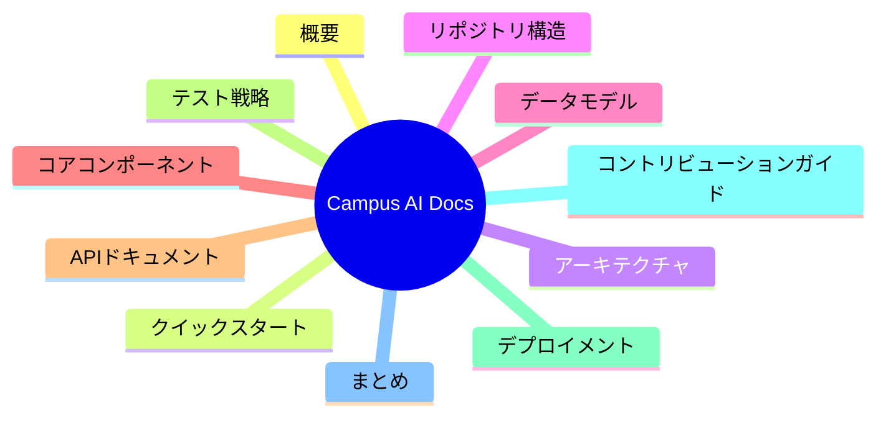

# 📚 目次

## 📖 ナビゲーション

- [1. 概要](./01-概要.md)
- [2. クイックスタート](./02-クイックスタート.md)
- [3. アーキテクチャ](./03-アーキテクチャ.md)
- [4. リポジトリ構造](./04-リポジトリ構造.md)
- [5. データモデル](./05-データモデル.md)
- [6. コアコンポーネント](./06-コアコンポーネント.md)
- [7. APIドキュメント](./07-APIドキュメント.md)
- [8. テスト戦略](./08-テスト戦略.md)
- [9. デプロイメント](./09-デプロイメント.md)
- [10. コントリビューションガイド](./10-コントリビューションガイド.md)
- [11. まとめ](./11-まとめ.md)

## 🧭 ドキュメント構成図



## 🧩 参照例（CI バッチ）

```yaml
name: Run batch jobs

on:
  schedule:
    - cron: '*/10 * * * *' # 10分ごと
  workflow_dispatch: {} # 手動実行も許可
```
(参照: .github/workflows/batch-jobs.yml:1-6)

次に進む場合は [概要](./01-概要.md) を参照してください。
