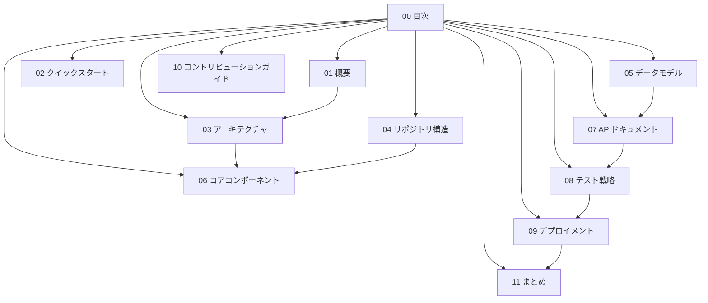

# 📚 Campus AI 提出用ドキュメント目次

このディレクトリは、`campus-ai` モノレポの提出用ドキュメントです。
構成ファイル `生成指示書/ドキュメント構成.md` は存在しないため、コード構造から 00-11 を自動構成しています。

## 📖 目次

- [01. 概要](./01-概要.md)
- [02. クイックスタート](./02-クイックスタート.md)
- [03. アーキテクチャ](./03-アーキテクチャ.md)
- [04. リポジトリ構造](./04-リポジトリ構造.md)
- [05. データモデル](./05-データモデル.md)
- [06. コアコンポーネント](./06-コアコンポーネント.md)
- [07. APIドキュメント](./07-APIドキュメント.md)
- [08. テスト戦略](./08-テスト戦略.md)
- [09. デプロイメント](./09-デプロイメント.md)
- [10. コントリビューションガイド](./10-コントリビューションガイド.md)
- [11. まとめ](./11-まとめ.md)

## 🗺️ 読み方

- 初見で全体像を掴む: [01. 概要](./01-概要.md) → [03. アーキテクチャ](./03-アーキテクチャ.md)
- 実行手順を確認する: [02. クイックスタート](./02-クイックスタート.md) → [09. デプロイメント](./09-デプロイメント.md)
- 実装の中身を追う: [04. リポジトリ構造](./04-リポジトリ構造.md) → [06. コアコンポーネント](./06-コアコンポーネント.md) → [07. APIドキュメント](./07-APIドキュメント.md)
- DBとタグ機能を確認する: [05. データモデル](./05-データモデル.md)

## 🔗 ドキュメント関係図

```mermaid
flowchart TD
  T[00 目次]
  O[01 概要]
  Q[02 クイックスタート]
  A[03 アーキテクチャ]
  R[04 リポジトリ構造]
  D[05 データモデル]
  C[06 コアコンポーネント]
  API[07 APIドキュメント]
  TS[08 テスト戦略]
  DEP[09 デプロイメント]
  CG[10 コントリビューションガイド]
  S[11 まとめ]

  T --> O
  T --> Q
  T --> A
  T --> R
  T --> D
  T --> C
  T --> API
  T --> TS
  T --> DEP
  T --> CG
  T --> S

  O --> A
  A --> C
  R --> C
  D --> API
  API --> TS
  TS --> DEP
  DEP --> S
```

## 🧾 分析対象の主な実体

- Web アプリ（投稿・検索・API）: `../apps/review-page`
- LINE Webhook: `../apps/line-ai-bot`
- 公開ブラウザ: `../apps/subject-browser`
- CI バッチ: `../.github/workflows/batch-jobs.yml`
- スキーマ資料: `./ddl-test.sql`

(参照: `../README.md:1-27`)
