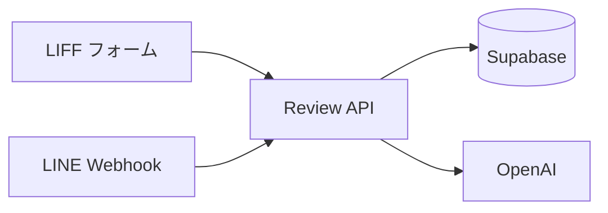

# 📝 概要

## プロジェクト概要

Campus AI は、大学向けの LINE チャットボット型レビュー/QAシステムです。学生が LIFF フォームから授業レビューを投稿し、Supabase に保存したレビューを OpenAI で要約・Embedding 化して検索に活用します。フロントは Next.js + LIFF、バックエンドは Next.js API Routes を中心に構成されています。(report.md:77-78)

## 運用構成（現行）

- Vercel は2プロジェクト構成で、review 側は `apps/review-page`、line 側は `apps/line-ai-bot` を Root に運用します。(report.md:13-18)
- LINE Webhook は line 側から review 側 `/api/ask` を参照します。(report.md:20-23)

## 概要フロー図



## 代表スニペット（プロジェクトの中心依存）

```jsonc
{
  "name": "review-page",
  "scripts": {
    "dev": "next dev", // 開発サーバー
    "build": "next build" // 本番ビルド
  }
}
```
(参照: apps/review-page/package.json:1-8)

次に進む場合は [クイックスタート](./02-クイックスタート.md) を参照してください。
