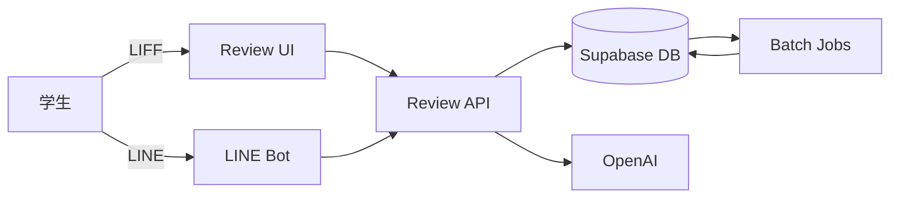

# 📝 概要

## プロジェクト概要

Campus AI は、大学向けの LINE チャットボット型レビュー/QAシステムです。学生が LIFF フォームで授業や企業レビューを投稿し、Supabase に保存したレビューを OpenAI で要約・Embedding 化して検索や回答生成に活用します。フロントは Next.js + LIFF、バックエンドは Next.js API Routes を中心に構成されています。(参照: README.md:1-27)

## 目的

- 学生が「授業の難易度・満足度・出席厳しさ」などを匿名で共有できる仕組みを用意する。
- LINE で質問すると、DBに基づいて要約と統計（review_count, 平均値など）を返す。
- 管理者の手作業を減らし、AIにより不適切レビューの検出・要約更新を自動化する。

## 対象ユーザーと機能範囲

- 学生: LIFF からレビュー投稿、LINE から授業/企業の質問。
- 運用者: Supabase を通じたデータ管理、バッチの運用。

レビューは「授業（course）」と「企業（company）」の2系統を扱います。授業は科目集計（subject_rollups）、企業は学部×企業単位の集計（company_rollups）を持ちます。

## リポジトリ構成（概要）

```text
apps/
  review-page/      # Review/Companyレビュー投稿 + API本体
  line-ai-bot/      # LINE Webhook + 会話ログ・要約
  subject-browser/  # 大学・科目の公開ブラウザ
wiki/               # ドキュメント
report.md           # 既存まとめ（運用パッチ含む）
```
(参照: README.md:5-27)

## 技術スタック

- フロント/バック: Next.js (app router) + React (review-page, subject-browser)
- Bot: LINE Webhook (line-ai-bot) + OpenAI
- DB: Supabase (PostgreSQL + pgvector)

Next.js/React/OpenAI/Supabase は review-page の依存に含まれます。(参照: apps/review-page/package.json:1-33)

## 全体像（概略）



## 代表的なコード断片

```jsonc
{
  "name": "review-page",
  "scripts": {
    "dev": "next dev", // 開発サーバー
    "seed:dummy": "node scripts/seed-dummy-data.mjs" // ダミーデータ投入
  }
}
```
(参照: apps/review-page/package.json:1-11)

次に進む場合は [クイックスタート](./02-クイックスタート.md) を参照してください。
