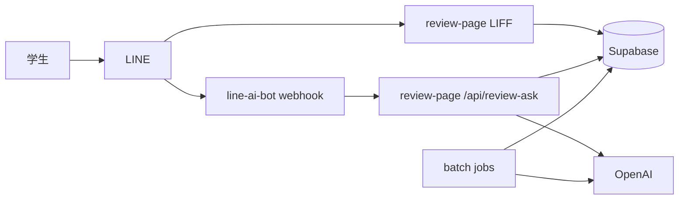

# 🧭 01. 概要

## 1.1 プロジェクトの目的

Campus AI は、学生のレビュー投稿と LINE チャット検索を統合した大学向けシステムです。

- 投稿: LIFF フォームから授業レビュー・企業レビューを投稿
- 集計: Supabase に保存し、バッチで要約と埋め込みを更新
- 検索: OpenAI Responses API の Function Calling で DB ツール実行を強制

(参照: `../README.md:1-27`、`../apps/review-page/app/api/review-ask/route.ts:1345-1477`)

## 1.2 アプリ構成

- `apps/review-page`: Next.js 14 (App Router) の投稿 UI と API
- `apps/line-ai-bot`: LINE Webhook（Node/Vercel Functions）
- `apps/subject-browser`: 大学・科目の公開閲覧 UI

(参照: `../apps/review-page/package.json:1-37`、`../apps/line-ai-bot/package.json:1-17`、`../apps/subject-browser/package.json:1-33`)

## 1.3 技術スタック

| 領域 | 採用技術 |
|---|---|
| フロント | Next.js 14, React 18, Tailwind CSS |
| LINE 連携 | LIFF SDK, LINE Messaging API |
| バックエンド | Next.js Route Handlers, Node.js API Functions |
| データ | Supabase (PostgreSQL + pgvector) |
| LLM | OpenAI Responses API / Embeddings API |
| 定期実行 | GitHub Actions + バッチ API |

## 1.4 システム全体図


```mermaid
flowchart LR
  U[学生]
  LINE[LINE]
  LIFF[review-page LIFF]
  BOT[line-ai-bot webhook]
  ASK[review-page /api/review-ask]
  DB[(Supabase)]
  OAI[OpenAI]
  BATCH[batch jobs]

  U --> LINE
  LINE --> BOT
  LINE --> LIFF
  BOT --> ASK
  LIFF --> DB
  ASK --> DB
  ASK --> OAI
  BATCH --> DB
  BATCH --> OAI
```

## 1.5 重要な実装方針

- 個人識別子は `LINE userId` をそのまま保存せず HMAC でハッシュ化
- DB 系質問では tool 呼び出しを優先し、根拠なし回答を抑制
- 直近会話 + `user_memory.summary_1000` をプロンプト文脈として利用
- ハッシュタグは正規化して `review_tags` と `course_review_tags` に分離保存

(参照: `../apps/review-page/app/api/course-reviews/route.ts:77-86`、`../apps/review-page/app/api/review-ask/route.ts:110-197`、`../apps/review-page/app/api/review-ask/route.ts:334-354`、`../apps/review-page/app/api/course-reviews/route.ts:426-457`)

## 1.6 コードスニペット（識別子の保護）

```ts
// apps/review-page/app/api/course-reviews/route.ts:80-86
function lineUserIdToHash(lineUserId: string) {
  const pepper = getEnv('LINE_HASH_PEPPER'); // 環境変数の秘密鍵
  if (!pepper) throw new Error('LINE_HASH_PEPPER is not set');
  return createHmac('sha256', pepper).update(lineUserId, 'utf8').digest('hex');
}
```

## 1.7 次に読むページ

- 実行手順: [02. クイックスタート](./02-クイックスタート.md)
- 詳細設計: [03. アーキテクチャ](./03-アーキテクチャ.md)
