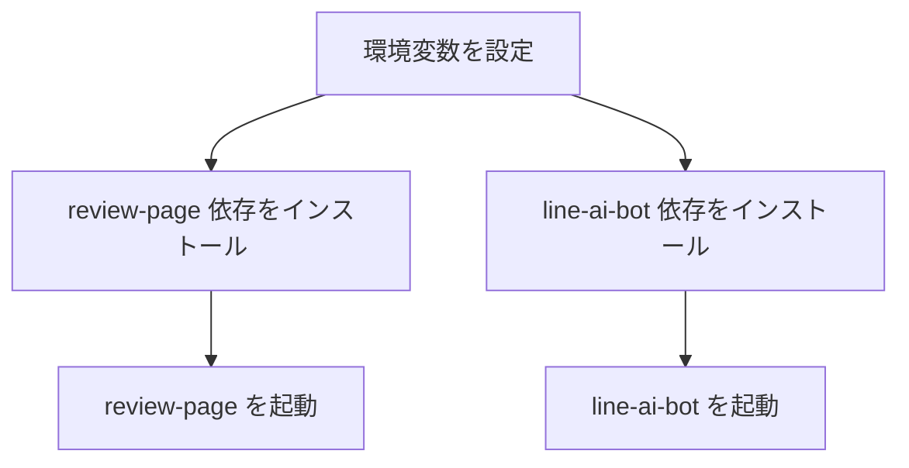

# 🚀 クイックスタート

## 前提

- Node.js 20系（`line-ai-bot` の engines 指定）。(apps/line-ai-bot/package.json:4-10)
- review 側の Next.js 開発サーバーを起動できる環境。 (apps/review-page/package.json:5-10)

## 環境変数（最低限）

- 共通: `SUPABASE_URL`, `SUPABASE_SERVICE_ROLE_KEY`, `LINE_HASH_PEPPER` (report.md:33-36)
- review: `OPENAI_API_KEY`, `BATCH_TOKEN`, `NEXT_PUBLIC_LIFF_ID` (report.md:38-42)
- line: `LINE_CHANNEL_SECRET`, `LINE_CHANNEL_ACCESS_TOKEN`, `ASK_API_URL` (report.md:44-47)

## ローカル起動の流れ



### review-page

```jsonc
{
  "scripts": {
    "dev": "next dev", // 開発サーバー
    "build": "next build", // 本番ビルド
    "start": "next start" // 本番起動
  }
}
```
(参照: apps/review-page/package.json:5-9)

### line-ai-bot

```jsonc
{
  "scripts": {
    "start": "node api/webhook.js" // LINE Webhook 起動
  }
}
```
(参照: apps/line-ai-bot/package.json:8-10)

## スモークテスト

- `GET https://line-liart.vercel.app/api/webhook` で稼働確認 (report.md:52-54)
- LINE からメッセージを送信し、返信が返ることを確認 (report.md:52-54)

次に進む場合は [アーキテクチャ](./03-アーキテクチャ.md) を参照してください。
