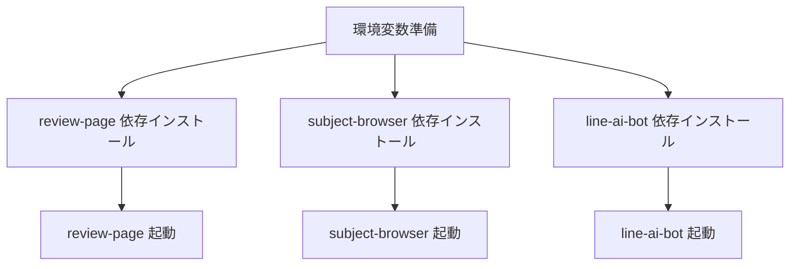

# 🚀 クイックスタート

## 前提条件

- Node.js 20.x（line-ai-bot が指定）(参照: apps/line-ai-bot/package.json:1-16)
- Supabase プロジェクト（URL + Service Role Key）
- LINE Developers（チャネルシークレット/アクセストークン）
- OpenAI API キー

## セットアップ概要



## 1. 環境変数

review-page は `.env.example` を基に設定します。(参照: apps/review-page/.env.example:1-6)

```env
NEXT_PUBLIC_LIFF_ID=... # LINE LIFF ID
SUPABASE_URL=...        # Supabase URL
SUPABASE_SERVICE_ROLE_KEY=... # Service Role Key
OPENAI_API_KEY=...      # OpenAI API Key
LINE_HASH_PEPPER=...    # LINE userId ハッシュの pepper
```
(参照: apps/review-page/.env.example:1-6)

line-ai-bot は `api/webhook.js` のコメントに必要な環境変数が記載されています。

```text
SUPABASE_URL
SUPABASE_SERVICE_ROLE_KEY
LINE_CHANNEL_SECRET
LINE_CHANNEL_ACCESS_TOKEN
OPENAI_API_KEY
ASK_REVIEW_API_URL   # review-page 側の /api/review-ask
ASK_COMPANY_API_URL  # review-page 側の /api/company-ask
```
(参照: apps/line-ai-bot/api/webhook.js:12-25)

subject-browser は Supabase の環境変数が必要です。

```ts
const url = process.env.SUPABASE_URL; // Supabase URL
const key = process.env.SUPABASE_SERVICE_ROLE_KEY; // Service Role Key
```
(参照: apps/subject-browser/lib/supabaseAdmin.ts:5-15)

## 2. 依存インストール

各アプリで個別に依存を入れます。

```bash
# review-page
cd apps/review-page
npm install

# subject-browser
cd ../subject-browser
npm install

# line-ai-bot
cd ../line-ai-bot
npm install
```

## 3. 開発起動

review-page:

```bash
npm run dev # Next.js 開発サーバー
```
(参照: apps/review-page/package.json:5-10)

subject-browser:

```bash
npm run dev # Next.js 開発サーバー
```
(参照: apps/subject-browser/package.json:5-9)

line-ai-bot:

```bash
npm run start # webhook 起動
```
(参照: apps/line-ai-bot/package.json:8-10)

## 4. ダミーデータ投入（任意）

review-page の seed スクリプトでダミーデータを投入できます。

```bash
npm run seed:dummy # dummy reviews を投入
```
(参照: apps/review-page/package.json:5-10)

## 5. 動作確認のポイント

- LINE Webhook が /api/webhook を受け付けること。(参照: apps/line-ai-bot/vercel.json:1-5)
- LIFF フォームからレビュー投稿できること。(参照: apps/review-page/app/course_reviews/page.tsx:424-520)
- subject-browser で大学/科目の検索ができること。(参照: apps/subject-browser/app/page.tsx:38-120)

次に進む場合は [アーキテクチャ](./03-アーキテクチャ.md) を参照してください。
