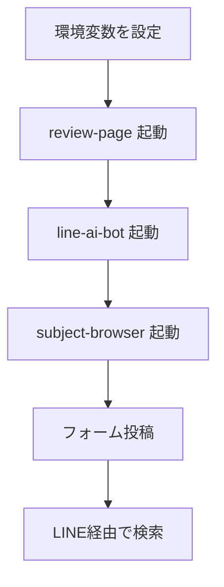

# 🚀 02. クイックスタート

## 2.1 前提条件

- Node.js 20 系
- npm
- Supabase プロジェクト（`SUPABASE_URL`, `SUPABASE_SERVICE_ROLE_KEY`）
- OpenAI API キー
- LINE チャネル情報（Webhook運用時）

(参照: `../apps/line-ai-bot/package.json:5-7`)

## 2.2 環境変数

### `apps/review-page/.env.local`

- 必須: `SUPABASE_URL`, `SUPABASE_SERVICE_ROLE_KEY`, `OPENAI_API_KEY`, `LINE_HASH_PEPPER`
- LIFF: `NEXT_PUBLIC_LIFF_ID`, `NEXT_PUBLIC_LIFF_ID_COMPANY`
- 任意（テストDB切替）: `TEST_SUPABASE_URL`, `TEST_SUPABASE_SERVICE_ROLE_KEY`

(参照: `../apps/review-page/.env.example:1-25`、`../apps/review-page/lib/env.ts:1-12`)

### `apps/line-ai-bot/.env`

- 必須: `SUPABASE_URL`, `SUPABASE_SERVICE_ROLE_KEY`, `LINE_CHANNEL_SECRET`, `LINE_CHANNEL_ACCESS_TOKEN`, `OPENAI_API_KEY`
- 連携先: `ASK_REVIEW_API_URL`, `ASK_COMPANY_API_URL`（または `ASK_API_URL`）
- 任意（テストDB切替）: `TEST_SUPABASE_URL`, `TEST_SUPABASE_SERVICE_ROLE_KEY`

(参照: `../apps/line-ai-bot/.env.example:1-24`、`../apps/line-ai-bot/lib/env.js:1-8`)

## 2.3 ローカル起動

```bash
# review-page
cd apps/review-page
npm install
npm run dev

# line-ai-bot
cd ../line-ai-bot
npm install
npm start

# subject-browser
cd ../subject-browser
npm install
npm run dev
```

## 2.4 動作確認（最短）

1. `review-page` で `/course_reviews` を開く
2. 必須項目を入力してレビュー投稿
3. `line-ai-bot` の Webhook でメッセージ受信ログを確認
4. `review-ask` へデバッグ付きで POST して tool 実行を確認

```bash
curl -s -X POST "https://<review-page-domain>/api/review-ask" \
  -H "Content-Type: application/json" \
  -H "x-ask-debug: 1" \
  -d '{"line_user_id":"<LINE_USER_ID>","message":"#高難易度"}'
```

(参照: `../apps/line-ai-bot/api/webhook.js:488-506`、`../apps/review-page/app/api/review-ask/route.ts:1481-1535`)

## 2.5 セットアップフロー


```mermaid
flowchart TD
  A[環境変数を設定] --> B[review-page 起動]
  B --> C[line-ai-bot 起動]
  C --> D[subject-browser 起動]
  D --> E[フォーム投稿]
  E --> F[LINE経由で検索]
```

## 2.6 コードスニペット（テストDB切替）

```ts
// apps/review-page/lib/env.ts:1-8
const TEST_DB_KEYS = new Set(['SUPABASE_URL', 'SUPABASE_SERVICE_ROLE_KEY']);

export function getEnv(name: string) {
  if (TEST_DB_KEYS.has(name)) {
    return process.env[`TEST_${name}`] ?? process.env[name]; // DBのみTEST_優先
  }
  return process.env[name];
}
```

## 2.7 補足

依存インストール前は `npm run build` / `npm run lint` を実行できません。提出前チェックは [08. テスト戦略](./08-テスト戦略.md) を参照してください。
