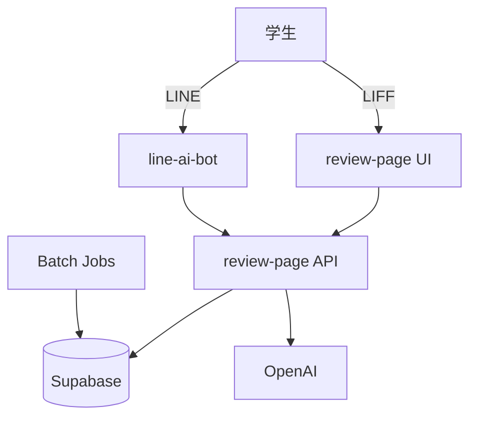
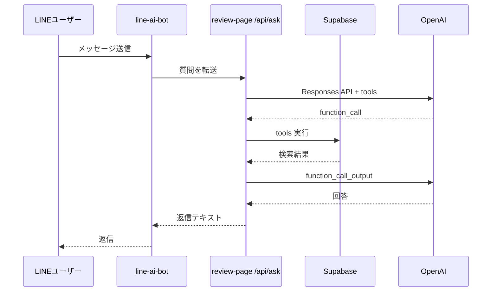
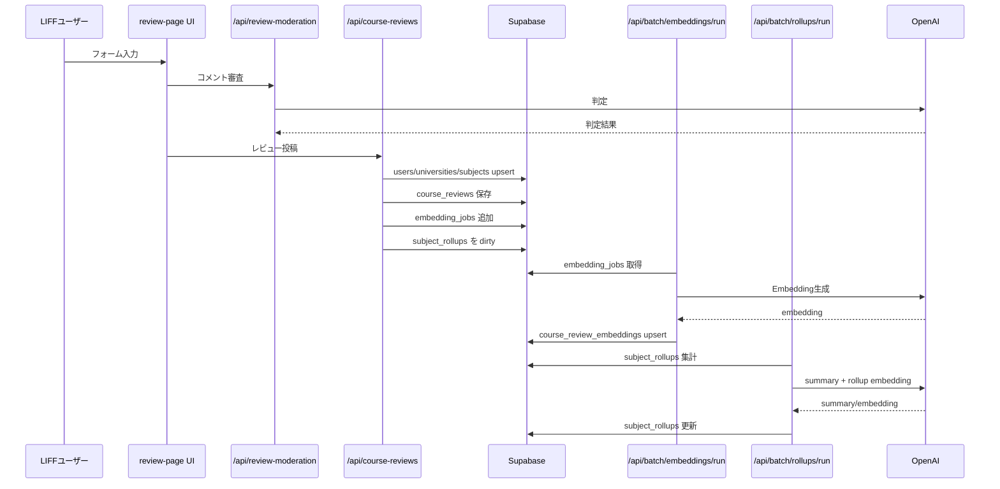

# 🏗️ アーキテクチャ

## 全体構成

- review-page: LIFF フォームと API の中核。レビュー投稿、QA、バッチ実行の入口。
- line-ai-bot: LINE Webhook 受信、署名検証、会話ログ保存、review-page API の呼び出し。
- subject-browser: 大学/科目の公開検索ページ。



## 主な責務分離

- QA（授業）: `/api/ask` or `/api/review-ask` が OpenAI tools と Supabase 検索を統合。(参照: apps/review-page/app/api/ask/route.ts:9-481)
- QA（企業）: `/api/company-ask` が企業レビュー用の tools を持つ。(参照: apps/review-page/app/api/company-ask/route.ts:9-169)
- 投稿: `/api/course-reviews` と `/api/company-reviews` が DB への upsert とレビュー保存を担当。(参照: apps/review-page/app/api/course-reviews/route.ts:14-239, apps/review-page/app/api/company-reviews/route.ts:75-200)
- 不適切レビュー検知: `/api/review-moderation` が OpenAI で判定。(参照: apps/review-page/app/api/review-moderation/route.ts:6-194)

## シーケンス（LINE質問→回答）



## シーケンス（レビュー投稿→集計）



## 代表的な制御ロジック

QA の tool 強制判定は、キーワードや短文判定で tool_choice を required にします。

```ts
function shouldForceTool(userMessage: string) {
  const keywords = ['授業', '科目', '講義', 'おすすめ']; // DBを使う質問判定
  return keywords.some((k) => userMessage.toLowerCase().includes(k));
}
```
(参照: apps/review-page/app/api/ask/route.ts:168-237)

次に進む場合は [リポジトリ構造](./04-リポジトリ構造.md) を参照してください。
