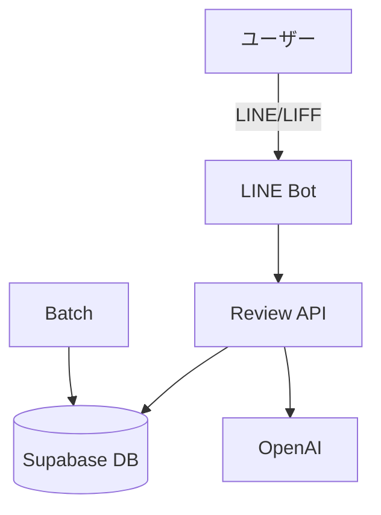

# 🏗️ アーキテクチャ

## 全体像

- LINE Bot と LIFF フォームからの入力を review 側 API が集約し、Supabase へ保存します。(report.md:111-133)
- バッチ処理は embeddings / rollups を分離して実行する方針です。(report.md:136-137)



## モノレポの運用

- review 側は `apps/review-page`、line 側は `apps/line-ai-bot` で運用します。(report.md:13-18)

## デプロイ構成（line 側）

```jsonc
{
  "builds": [{ "src": "api/webhook.js", "use": "@vercel/node" }], // Webhook を Node で実行
  "routes": [{ "src": "/api/webhook", "dest": "api/webhook.js" }] // ルーティング
}
```
(参照: apps/line-ai-bot/vercel.json:1-4)

詳細は [リポジトリ構造](./04-リポジトリ構造.md) を参照してください。
