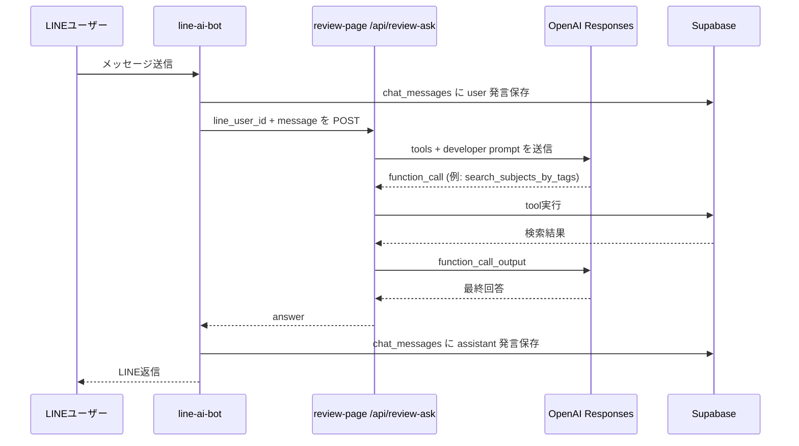
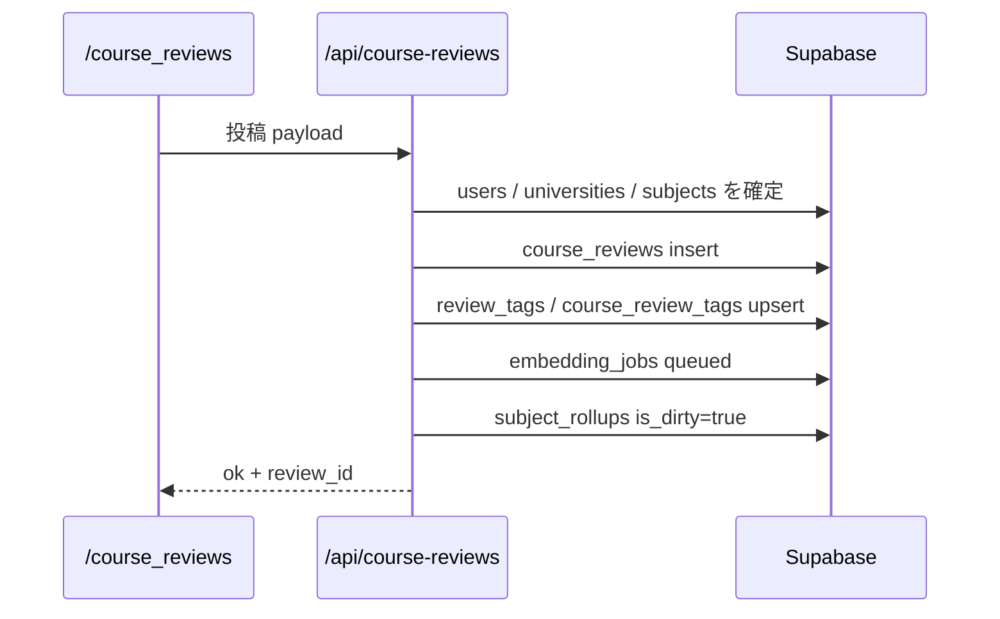

# 🏗️ 03. アーキテクチャ

## 3.1 コンポーネント境界

- UI層: LIFF フォーム (`/course_reviews`, `/company_reviews`) と公開ブラウザ
- API層: `review-page` の Route Handler 群（投稿、検索、バッチ）
- Bot層: `line-ai-bot` が LINE Webhook を受け、`review-ask/company-ask` に委譲
- データ層: Supabase（レビュー、タグ、会話、集計、埋め込み）
- AI層: OpenAI Responses API（tool calling）と Embeddings API

(参照: `../apps/review-page/app/page.tsx:1-5`、`../apps/line-ai-bot/api/webhook.js:485-515`)

## 3.2 チャット応答フロー（tool calling）


```mermaid
sequenceDiagram
  participant User as LINEユーザー
  participant Bot as line-ai-bot
  participant Ask as review-page /api/review-ask
  participant OAI as OpenAI Responses
  participant DB as Supabase

  User->>Bot: メッセージ送信
  Bot->>DB: chat_messages に user 発言保存
  Bot->>Ask: line_user_id + message を POST
  Ask->>OAI: tools + developer prompt を送信
  OAI-->>Ask: function_call (例: search_subjects_by_tags)
  Ask->>DB: tool実行
  DB-->>Ask: 検索結果
  Ask->>OAI: function_call_output
  OAI-->>Ask: 最終回答
  Ask-->>Bot: answer
  Bot->>DB: chat_messages に assistant 発言保存
  Bot-->>User: LINE返信
```

(参照: `../apps/line-ai-bot/api/webhook.js:482-540`、`../apps/review-page/app/api/review-ask/route.ts:1345-1477`)

## 3.3 レビュー投稿フロー


```mermaid
sequenceDiagram
  participant LIFF as /course_reviews
  participant API as /api/course-reviews
  participant DB as Supabase

  LIFF->>API: 投稿 payload
  API->>DB: users / universities / subjects を確定
  API->>DB: course_reviews insert
  API->>DB: review_tags / course_review_tags upsert
  API->>DB: embedding_jobs queued
  API->>DB: subject_rollups is_dirty=true
  API-->>LIFF: ok + review_id
```

(参照: `../apps/review-page/app/course_reviews/page.tsx:618-658`、`../apps/review-page/app/api/course-reviews/route.ts:317-526`)

## 3.4 バッチ処理フロー

- Embedding バッチ: `embedding_jobs` / `company_embedding_jobs` を処理
- Rollup バッチ: `subject_rollups.is_dirty=true` / `company_rollups.is_dirty=true` を処理
- GitHub Actions が 10 分ごとに `embeddings` と `rollups` を実行

```mermaid
flowchart LR
  GH[GitHub Actions cron] --> E[/api/batch/embeddings/run]
  GH --> R[/api/batch/rollups/run]
  E --> DB[(embedding_jobs, course_review_embeddings)]
  R --> DB2[(subject_rollups, subject_rollup_embeddings)]
```

(参照: `../.github/workflows/batch-jobs.yml:1-35`、`../apps/review-page/app/api/batch/embeddings/run/route.ts:99-170`、`../apps/review-page/app/api/batch/rollups/run/route.ts:151-205`)

## 3.5 コードスニペット（Function Calling ループ）

```ts
// apps/review-page/app/api/review-ask/route.ts:1383-1389
let resp = await openai.responses.create({
  model: QA_MODEL,
  input,
  tools,
  tool_choice: forced, // review-ask は required 固定
  parallel_tool_calls: false,
});
```

## 3.6 補足

- `review-ask` は DB 根拠回答専用 (`tool_choice='required'`)
- `ask` は `review-ask` の再エクスポートとして運用し、ロジック差分を排除

(参照: `../apps/review-page/app/api/review-ask/route.ts:1356-1358`、`../apps/review-page/app/api/ask/route.ts:1-3`)
