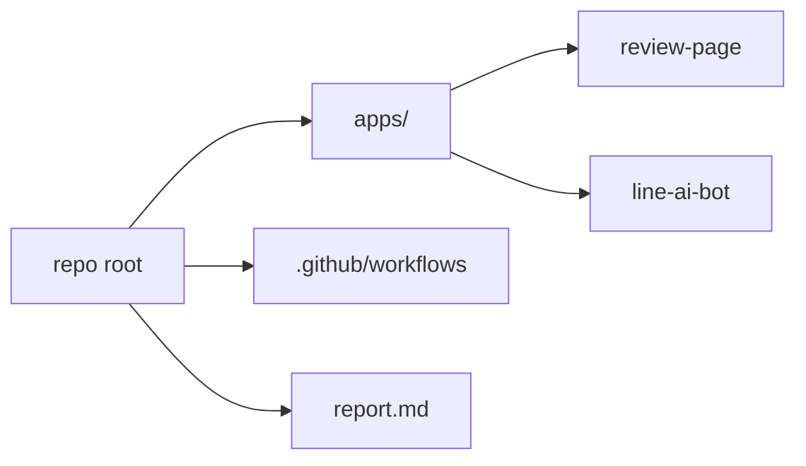

# 📁 リポジトリ構造

## ディレクトリ概要

```
.
├── apps/
│   ├── review-page/      # Next.js + LIFF フロント/API
│   └── line-ai-bot/      # LINE Webhook (Vercel)
├── .github/workflows/    # GitHub Actions
└── report.md             # 全体設計/DDLメモ
```

## 構造の関係図



## CI バッチの配置

```yaml
jobs:
  run-batch:
    runs-on: ubuntu-latest # GitHub Actions 実行環境
```
(参照: .github/workflows/batch-jobs.yml:9-11)

次に進む場合は [データモデル](./05-データモデル.md) を参照してください。
