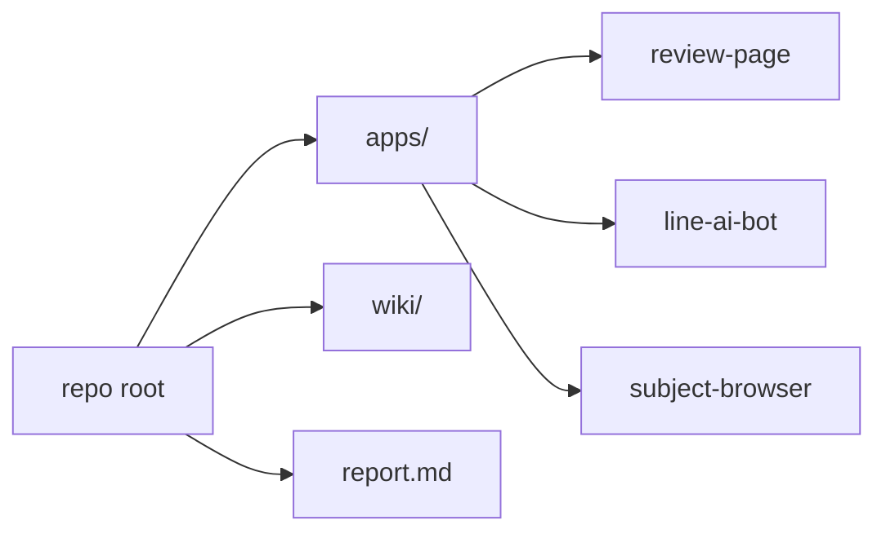

# 📁 リポジトリ構造

## ルート構成

```text
.
├── apps/
│   ├── review-page/        # LIFF フォーム + API 本体
│   ├── line-ai-bot/         # LINE Webhook
│   └── subject-browser/     # 大学・科目の公開ブラウザ
├── wiki/                    # ドキュメント
├── report.md                # 既存の設計まとめ・運用パッチ
└── jfoiasjfpoau intbupo8iawb poiawnyo  # git log のダンプファイル
```
(参照: README.md:5-27, jfoiasjfpoau intbupo8iawb poiawnyo:1-40)

## ディレクトリ間の関係



## apps/review-page

- Next.js app router ベース
- LIFF UI、レビュー投稿、QA、バッチ API を持つ

```ts
export const runtime = 'nodejs'; // サーバ実行
export const dynamic = 'force-dynamic'; // 動的レスポンス
```
(参照: apps/review-page/app/api/ask/route.ts:1-2)

## apps/line-ai-bot

- Vercel の Node function で `/api/webhook` を公開
- `index.js` は旧実装（linebot 利用の試験コード）として残存。運用は `api/webhook.js` が中心。

```json
{
  "builds": [{ "src": "api/webhook.js", "use": "@vercel/node" }], // Webhook を Node で実行
  "routes": [{ "src": "/api/webhook", "dest": "api/webhook.js" }]
}
```
(参照: apps/line-ai-bot/vercel.json:1-5)

```js
const bot = line({
  channelId: process.env.LINE_CHANNEL_ID, // 旧linebot実装の設定例
});
```
(参照: apps/line-ai-bot/index.js:5-9)

## apps/subject-browser

- 大学/科目の公開検索 UI + API

```ts
const res = await fetch('/api/public/universities'); // 大学一覧取得
```
(参照: apps/subject-browser/app/page.tsx:48-55)

次に進む場合は [データモデル](./05-データモデル.md) を参照してください。
