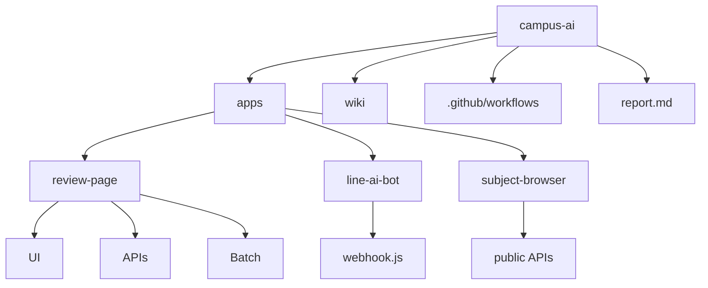

# 📁 04. リポジトリ構造

## 4.1 主要ディレクトリ

```text
.
├── apps/
│   ├── review-page/        # 投稿フォーム + API + バッチ
│   ├── line-ai-bot/        # LINE Webhook
│   └── subject-browser/    # 公開閲覧 UI
├── .github/workflows/      # 定期バッチ実行
├── wiki/                   # 提出ドキュメント
├── report.md               # 旧設計メモ（現行と差分あり）
└── README.md
```

(参照: `../README.md:5-27`、`../.github/workflows/batch-jobs.yml:1-35`)

## 4.2 `apps/review-page`

- UI: `app/course_reviews/page.tsx`, `app/company_reviews/page.tsx`
- 検索API: `app/api/review-ask/route.ts`, `app/api/company-ask/route.ts`
- 投稿API: `app/api/course-reviews/route.ts`, `app/api/company-reviews/route.ts`
- バッチAPI: `app/api/batch/*/run/route.ts`

(参照: `../apps/review-page/app/course_reviews/page.tsx:93-150`、`../apps/review-page/app/api/review-ask/route.ts:474-633`)

## 4.3 `apps/line-ai-bot`

- 入口: `api/webhook.js`
- 補助: `lib/env.js`, `lib/lineUserHash.js`
- デプロイ設定: `vercel.json`

(参照: `../apps/line-ai-bot/api/webhook.js:1-11`、`../apps/line-ai-bot/vercel.json:1-4`)

## 4.4 `apps/subject-browser`

- 一覧画面: `app/page.tsx`
- 詳細画面: `app/subjects/[subjectId]/page.tsx`
- 公開API: `app/api/public/*`

(参照: `../apps/subject-browser/app/page.tsx:38-98`、`../apps/subject-browser/app/api/public/subjects/route.ts:16-58`)

## 4.5 構造図


```mermaid
flowchart TD
  Root[campus-ai]
  Root --> Apps[apps]
  Root --> WIKI[wiki]
  Root --> GH[.github/workflows]
  Root --> Report[report.md]

  Apps --> RP[review-page]
  Apps --> BOT[line-ai-bot]
  Apps --> SB[subject-browser]

  RP --> RPUI[UI]
  RP --> RPA[APIs]
  RP --> RPB[Batch]

  BOT --> WB[webhook.js]
  SB --> PUB[public APIs]
```

## 4.6 コードスニペット（トップページ遷移）

```ts
// apps/review-page/app/page.tsx:1-5
import { redirect } from 'next/navigation';

export default function IndexPage() {
  redirect('/course_reviews'); // ルートは授業投稿画面へ転送
}
```

## 4.7 関連ページ

- 全体像: [03. アーキテクチャ](./03-アーキテクチャ.md)
- 実装の詳細: [06. コアコンポーネント](./06-コアコンポーネント.md)
