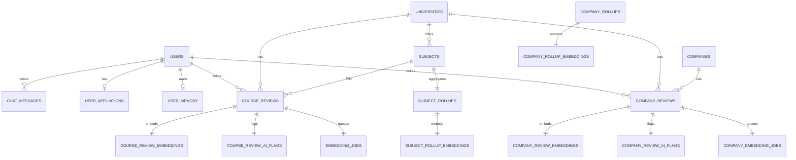

# 🗄️ データモデル

## モデル概要

- `users` は LINE userId を HMAC でハッシュ化した `line_user_hash` のみを保持します。(参照: wiki/ddl-context.sql:214-219, apps/review-page/lib/lineUserHash.ts:1-7)
- 授業レビューと企業レビューは別テーブルで保持し、集計用 rollup テーブルへ非同期で反映します。(参照: wiki/ddl-context.sql:52-108, 150-210)

## ER 図（主要関係）



## コアテーブル

### users / user_affiliations

```sql
CREATE TABLE public.users (
  id uuid NOT NULL DEFAULT gen_random_uuid(), -- 主キー
  line_user_hash character NOT NULL UNIQUE,   -- LINE userId のハッシュ
  created_at timestamp with time zone NOT NULL DEFAULT now()
);
```
(参照: wiki/ddl-context.sql:214-219)

```sql
CREATE TABLE public.user_affiliations (
  user_id uuid NOT NULL,
  university_id uuid NOT NULL,
  faculty text NOT NULL,
  department text
);
```
(参照: wiki/ddl-context.sql:196-205)

### universities / subjects

```sql
CREATE TABLE public.universities (
  id uuid NOT NULL DEFAULT gen_random_uuid(),
  name text NOT NULL UNIQUE
);
```
(参照: wiki/ddl-context.sql:186-191)

```sql
CREATE TABLE public.subjects (
  id uuid NOT NULL DEFAULT gen_random_uuid(),
  university_id uuid NOT NULL,
  name text NOT NULL
);
```
(参照: wiki/ddl-context.sql:176-183)

### course_reviews

```sql
CREATE TABLE public.course_reviews (
  id uuid NOT NULL DEFAULT gen_random_uuid(),
  user_id uuid NOT NULL,
  subject_id uuid NOT NULL,
  grade_at_take integer NOT NULL,   -- 1..6 or 99
  term text NOT NULL,               -- s1/s2/q1.../other
  body_main text NOT NULL           -- 本文
);
```
(参照: wiki/ddl-context.sql:120-149)

### company_reviews

```sql
CREATE TABLE public.company_reviews (
  id uuid NOT NULL DEFAULT gen_random_uuid(),
  user_id uuid NOT NULL,
  university_id uuid NOT NULL,
  company_id uuid NOT NULL,
  grad_year integer NOT NULL,
  outcome text NOT NULL,
  body_main text NOT NULL
);
```
(参照: wiki/ddl-context.sql:52-71)

## AI/Embedding 関連

- `course_review_embeddings` / `company_review_embeddings`: レビュー本文の embedding を保存。
- `subject_rollup_embeddings` / `company_rollup_embeddings`: 集計要約の embedding を保存。
- `course_review_ai_flags` / `company_review_ai_flags`: 不適切判定の記録。
- `embedding_jobs` / `company_embedding_jobs`: embedding 生成キュー。

```sql
CREATE TABLE public.embedding_jobs (
  review_id uuid NOT NULL,
  status text NOT NULL DEFAULT 'queued', -- queued/processing/done/failed
  attempt_count integer NOT NULL DEFAULT 0
);
```
(参照: wiki/ddl-context.sql:150-160)

## 集計テーブル（Rollups）

```sql
CREATE TABLE public.subject_rollups (
  subject_id uuid NOT NULL,
  summary_1000 text NOT NULL DEFAULT '',
  review_count integer NOT NULL DEFAULT 0,
  avg_satisfaction numeric,
  is_dirty boolean NOT NULL DEFAULT false
);
```
(参照: wiki/ddl-context.sql:162-174)

```sql
CREATE TABLE public.company_rollups (
  university_id uuid NOT NULL,
  faculty text NOT NULL,
  company_id uuid NOT NULL,
  summary_1000 text NOT NULL DEFAULT '',
  review_count integer NOT NULL DEFAULT 0,
  is_dirty boolean NOT NULL DEFAULT false
);
```
(参照: wiki/ddl-context.sql:92-108)

## 制約・バリデーションの要点

- `course_reviews.term` は s1/s2/q1/q2/q3/q4/full/intensive/other のみ。(参照: wiki/ddl-context.sql:127-133)
- `course_reviews.grade_at_take` は 1..6 か 99 (不明)。(参照: wiki/ddl-context.sql:125-126)
- `company_reviews.outcome` は offer/rejected/other。(参照: wiki/ddl-context.sql:59-60)
- `company_reviews.selection_types` は ES/テスト/面接/GD/課題/その他の配列。(参照: wiki/ddl-context.sql:63-64)

## 重要な運用上の補足

- `company_rollup_embeddings` は DDL 上で外部キー制約が重複しており、実運用では (university_id, faculty, company_id) の複合参照として扱う前提で設計されています。(参照: wiki/ddl-context.sql:72-90)
- `line_user_hash` 生成は HMAC-SHA256 で実装されています。(参照: apps/review-page/lib/lineUserHash.ts:1-7)

次に進む場合は [コアコンポーネント](./06-コアコンポーネント.md) を参照してください。
