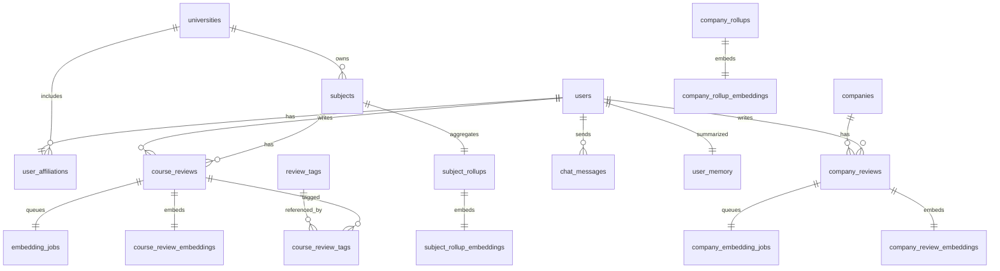

# 🗄️ 05. データモデル

## 5.1 モデル全体

本システムは、授業レビュー系・企業レビュー系・会話ログ系に分かれます。

- 共通ID基盤: `users`, `universities`, `user_affiliations`
- 授業レビュー: `subjects`, `course_reviews`, `course_review_ai_flags`, `course_review_embeddings`, `embedding_jobs`, `subject_rollups`, `subject_rollup_embeddings`
- タグ機能: `review_tags`, `course_review_tags`
- 企業レビュー: `companies`, `company_reviews`, `company_review_ai_flags`, `company_review_embeddings`, `company_embedding_jobs`, `company_rollups`, `company_rollup_embeddings`
- 会話: `chat_messages`, `user_memory`

(参照: `./ddl-test.sql:27-321`)

## 5.2 ER 図（主要テーブル）


```mermaid
erDiagram
  users ||--|| user_affiliations : has
  universities ||--o{ user_affiliations : includes
  universities ||--o{ subjects : owns
  users ||--o{ course_reviews : writes
  subjects ||--o{ course_reviews : has
  course_reviews ||--|| embedding_jobs : queues
  course_reviews ||--|| course_review_embeddings : embeds
  subjects ||--|| subject_rollups : aggregates
  subject_rollups ||--|| subject_rollup_embeddings : embeds
  review_tags ||--o{ course_review_tags : referenced_by
  course_reviews ||--o{ course_review_tags : tagged
  users ||--o{ chat_messages : sends
  users ||--|| user_memory : summarized

  companies ||--o{ company_reviews : has
  users ||--o{ company_reviews : writes
  company_reviews ||--|| company_embedding_jobs : queues
  company_reviews ||--|| company_review_embeddings : embeds
  company_rollups ||--|| company_rollup_embeddings : embeds
```

## 5.3 授業レビューの要点

- `course_reviews` は `subject_id` を中心に保持
- 現行運用では、`teacher_names` は 1 名以上必須（API側）
- 評価項目は `class_difficulty`, `assignment_difficulty_4`, `attendance_strictness`, `recommendation` を重視
- タグはレビュー本体から分離し、`review_tags`（辞書）+ `course_review_tags`（関連）で管理

(参照: `../apps/review-page/app/api/course-reviews/route.ts:266-314`、`../apps/review-page/app/api/course-reviews/route.ts:426-457`)

## 5.4 タグ機能の要点

- 保存時: `#` を除去・小文字化・最大12文字に正規化
- 登録時: `review_tags` に upsert し、`course_review_tags` へ関連付け
- 検索時: `search_subjects_by_tags` がタグ一致レビュー数 `tag_review_count` を科目単位で返す

(参照: `../apps/review-page/app/api/course-reviews/route.ts:102-110`、`../apps/review-page/app/api/review-ask/route.ts:736-926`、`./ddl-test.sql:296-318`)

## 5.5 会話ログの要点

- `chat_messages` に user/assistant の会話を保存
- `user_memory.summary_1000` を長期記憶として管理
- `review-ask` では直近4件を文脈に利用

(参照: `../apps/line-ai-bot/api/webhook.js:482-547`、`../apps/review-page/app/api/review-ask/route.ts:1499-1505`、`./ddl-test.sql:274-291`)

## 5.6 コードスニペット（タグ保存）

```ts
// apps/review-page/app/api/course-reviews/route.ts:430-447
const { data: tagRows } = await supabaseAdmin
  .from('review_tags')
  .upsert(tagPayload, { onConflict: 'name' }) // 既存タグは再利用
  .select('id,name,usage_count');

const links = (tagRows || []).map((t) => ({
  review_id: insertedReviewId,
  tag_id: t.id,
}));
await supabaseAdmin.from('course_review_tags').upsert(links, { onConflict: 'review_id,tag_id' });
```

## 5.7 補足

提出時点で運用中の最新DDL（会話内共有版）では、`course_reviews` の一部カラムが任意化されています。
`ddl-test.sql` の `ALTER TABLE` 章と、実DBスキーマを一致させて運用してください。

(参照: `./ddl-test.sql:324-330`)
