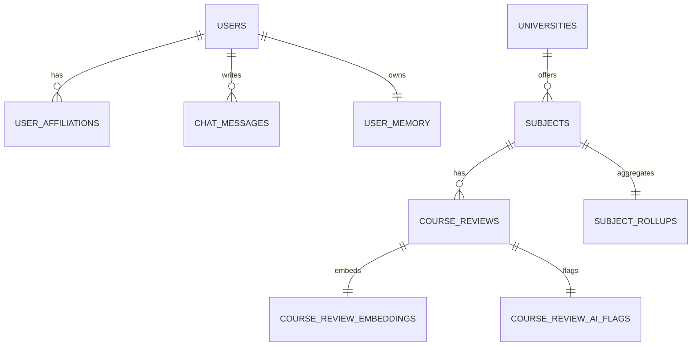

# 🗄️ データモデル

## モデル方針

- LINE ユーザーIDはハッシュ化して `users.line_user_hash` に保存します。(report.md:81-83)
- 1ユーザー=1スレッドの会話ログを `chat_messages` に保存します。(report.md:83-86)

## ER 図（要約）



## 主要テーブル（DDL抜粋）

```sql
CREATE TABLE public.users (
  id uuid NOT NULL DEFAULT gen_random_uuid(), -- 主キー
  line_user_hash character NOT NULL UNIQUE,   -- LINE userId のハッシュ
  created_at timestamp with time zone NOT NULL DEFAULT now(),
  CONSTRAINT users_pkey PRIMARY KEY (id)
);

CREATE TABLE public.course_reviews (
  id uuid NOT NULL DEFAULT gen_random_uuid(), -- 主キー
  user_id uuid NOT NULL,                      -- users.id
  subject_id uuid NOT NULL,                   -- subjects.id
  academic_year integer NOT NULL,
  term text NOT NULL,
  body_main text NOT NULL,
  CONSTRAINT course_reviews_pkey PRIMARY KEY (id)
);
```
(参照: report.md:361-386,463-468)

## バッチ関連

- `embedding_jobs` が embeddings 処理のキュー役です。(report.md:387-398)
- `subject_rollups` / `subject_rollup_embeddings` が集計・要約の出力先です。(report.md:399-428)

次に進む場合は [コアコンポーネント](./06-コアコンポーネント.md) を参照してください。
