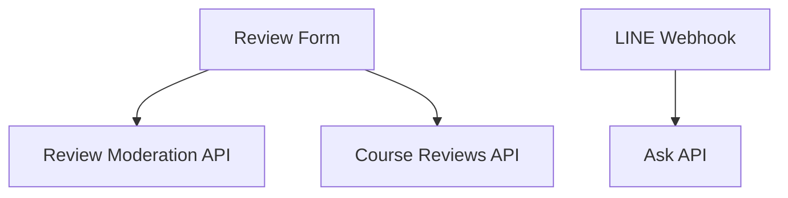

# 🧩 コアコンポーネント

## 構成一覧

- Review フォーム（LIFF + Next.js）
- QA/DB検索 (`/api/ask`)
- レビュー投稿 (`/api/course-reviews`)
- コメント審査 (`/api/review-moderation`)
- LINE Webhook (`apps/line-ai-bot/api/webhook.js`)



## Review フォーム（クライアント）

- 送信前に `review-moderation` を呼び出し、警告対象なら確認ダイアログを表示します。

```tsx
const moderationRes = await fetch('/api/review-moderation', {
  method: 'POST',
  headers: { 'Content-Type': 'application/json' },
  body: JSON.stringify({ comment: form.comment.trim() }), // 入力コメント
});
```
(参照: apps/review-page/app/page.tsx:399-405)

## QA/DB検索（/api/ask）

- ルールベースで tool 呼び出しを強制する保険ロジックを備えています。

```ts
function shouldForceTool(userMessage: string) {
  const t = userMessage.toLowerCase();
  const keywords = ['授業', '科目', 'おすすめ', 'レビュー'];
  return keywords.some((k) => t.includes(k)); // キーワードで tool を要求
}
```
(参照: apps/review-page/app/api/ask/route.ts:127-155)

## コメント審査 API（/api/review-moderation）

```ts
const resp = await openai.responses.create({
  model: MODERATION_MODEL, // 審査モデル
  input: [
    { role: 'developer', content: prompt },
    { role: 'user', content: comment },
  ],
});
```
(参照: apps/review-page/app/api/review-moderation/route.ts:59-65)

## LINE Webhook（line-ai-bot）

- 署名検証や raw body 取得を行い、LINE からのイベントを安全に処理します。

```js
function verifyLineSignature(rawBodyBuffer, signatureBase64, channelSecret) {
  const expected = crypto.createHmac("sha256", channelSecret)
    .update(rawBodyBuffer)
    .digest("base64");
  return crypto.timingSafeEqual(Buffer.from(signatureBase64), Buffer.from(expected));
}
```
(参照: apps/line-ai-bot/api/webhook.js:34-42)

次に進む場合は [APIドキュメント](./07-APIドキュメント.md) を参照してください。
