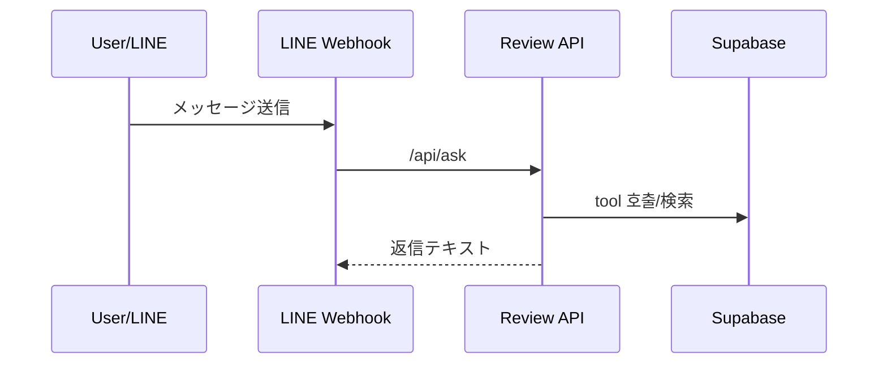

# 📡 APIドキュメント

## API マップ



## Review 側 API

### POST `/api/ask`
- 役割: 質問を受け取り、tool を介して Supabase を参照して回答する。(apps/review-page/app/api/ask/route.ts:9-20)

```ts
const QA_MODEL = process.env.OPENAI_QA_MODEL || 'gpt-5-mini'; // QAモデル
const ASK_DEBUG = process.env.ASK_DEBUG === '1'; // デバッグ出力
```
(参照: apps/review-page/app/api/ask/route.ts:28-36)

### POST `/api/course-reviews`
- 役割: レビュー投稿を受け取り、大学・科目・ユーザーを upsert した上で保存する。(apps/review-page/app/api/course-reviews/route.ts:1-98)

```ts
const teacherNames = (body.teacher_names ?? [])
  .map((s) => (s ?? '').trim())
  .filter(Boolean); // 空白は除外
```
(参照: apps/review-page/app/api/course-reviews/route.ts:117-126)

### POST `/api/review-moderation`
- 役割: コメント内容を AI で審査し、警告フラグを返す。(apps/review-page/app/api/review-moderation/route.ts:33-85)

```ts
return NextResponse.json({ ok: true, result }); // AI判定結果を返却
```
(参照: apps/review-page/app/api/review-moderation/route.ts:75-85)

### POST `/api/users/resolve`
- 役割: LINE userId をハッシュ化し、users.id を返す。(apps/review-page/app/api/users/resolve/route.ts:1-60)

```ts
const userId = await getOrCreateUserId(body.line_user_id); // users.id を返す
```
(参照: apps/review-page/app/api/users/resolve/route.ts:69-77)

### POST `/api/user-affiliations/latest`
- 役割: 最新所属を取得してフォームの事前入力に利用。(apps/review-page/app/api/user-affiliations/latest/route.ts:1-64)

```ts
const { data: aff } = await supabaseAdmin
  .from('user_affiliations')
  .select('university_id, faculty, department')
  .eq('user_id', body.user_id)
  .maybeSingle(); // 最新所属を取得
```
(参照: apps/review-page/app/api/user-affiliations/latest/route.ts:26-40)

### POST `/api/batch/embeddings/run`
- 役割: `embedding_jobs` を処理して `course_review_embeddings` を upsert。(apps/review-page/app/api/batch/embeddings/run/route.ts:1-20)

```ts
const { data: jobs } = await supabaseAdmin
  .from('embedding_jobs')
  .select('review_id,status,attempt_count,locked_at,locked_by'); // ジョブ取得
```
(参照: apps/review-page/app/api/batch/embeddings/run/route.ts:66-109)

### POST `/api/batch/rollups/run`
- 役割: `subject_rollups` の集計と summary/embedding を更新。(apps/review-page/app/api/batch/rollups/run/route.ts:1-37)

```ts
const { data: dirty } = await supabaseAdmin
  .from('subject_rollups')
  .select('subject_id,summary_1000,last_processed_review_id,updated_at')
  .eq('is_dirty', true); // dirty な科目のみ
```
(参照: apps/review-page/app/api/batch/rollups/run/route.ts:98-114)

## LINE 側 API

### POST `/api/webhook`
- 役割: LINE 署名検証・Supabase 連携・`/api/ask` 呼び出しを行う。(apps/line-ai-bot/api/webhook.js:9-120)

```js
export const config = { api: { bodyParser: false } }; // raw body 取得用
```
(参照: apps/line-ai-bot/api/webhook.js:9-10)

次に進む場合は [テスト戦略](./08-テスト戦略.md) を参照してください。
