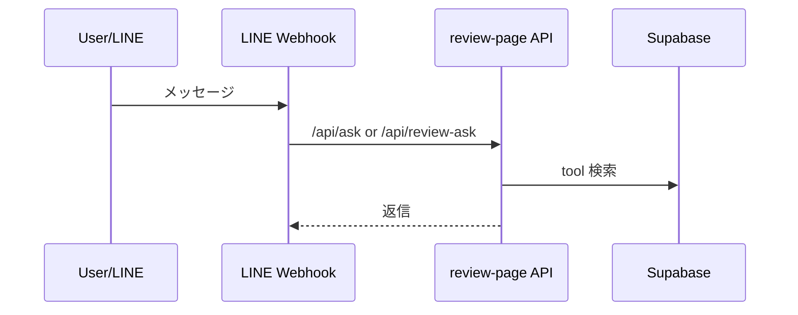

# 📡 APIドキュメント

## API マップ



## review-page API

### POST `/api/ask`
- 役割: 授業レビューDBに基づく質問回答。Responses API + tools を使用。
- 認証: なし（LINE Webhook 側で利用）
- 入力: `{ line_user_id, message, debug? }`

```ts
const QA_MODEL = process.env.OPENAI_QA_MODEL || 'gpt-5'; // QAモデル
const ASK_DEBUG = process.env.ASK_DEBUG === '1'; // デバッグフラグ
```
(参照: apps/review-page/app/api/ask/route.ts:28-36)

### POST `/api/review-ask`
- 役割: `/api/ask` 相当の授業レビュー専用版。
- 入力/出力は `/api/ask` と同等。
(参照: apps/review-page/app/api/review-ask/route.ts:1-70)

### POST `/api/company-ask`
- 役割: 企業レビューDBに基づく質問回答。

```ts
const PROMPT_DEVELOPER = `
あなたは「就活・企業レビューDB」を根拠に回答するアシスタント。
...`; // 企業用の指示文
```
(参照: apps/review-page/app/api/company-ask/route.ts:77-126)

### POST `/api/course-reviews`
- 役割: 授業レビュー投稿。
- 主なバリデーション: 年度/学期/評価/コメント長など。

```ts
const teacherNames = (body.teacher_names ?? [])
  .map((s) => (s ?? '').trim())
  .filter(Boolean); // 空白は除外
```
(参照: apps/review-page/app/api/course-reviews/route.ts:230-233)

### POST `/api/company-reviews`
- 役割: 企業レビュー投稿。
- outcome/selection_types/年収帯などをチェック。
(参照: apps/review-page/app/api/company-reviews/route.ts:75-200)

### POST `/api/review-moderation`
- 役割: コメント/入力フィールドの AI 判定。

```ts
return NextResponse.json({ ok: true, result }); // AI判定結果を返却
```
(参照: apps/review-page/app/api/review-moderation/route.ts:182-194)

### POST `/api/users/resolve`
- 役割: LINE userId をハッシュ化し users.id を返す。
(参照: apps/review-page/app/api/users/resolve/route.ts:27-77)

### POST `/api/user-affiliations/latest`
- 役割: user_id から大学名/学部/学科を返す。
(参照: apps/review-page/app/api/user-affiliations/latest/route.ts:20-69)

### GET `/api/companies/suggest`
- 役割: 企業名のサジェスト。
(参照: apps/review-page/app/api/companies/suggest/route.ts:16-39)

### POST `/api/batch/embeddings/run`
- 役割: `embedding_jobs` を処理し、`course_review_embeddings` を更新。

```ts
const { data: jobs } = await supabaseAdmin
  .from('embedding_jobs')
  .select('review_id,status,attempt_count,locked_at,locked_by');
```
(参照: apps/review-page/app/api/batch/embeddings/run/route.ts:118-121)

### POST `/api/batch/rollups/run`
- 役割: `subject_rollups` の集計・要約と rollup embedding の更新。

```ts
const { data: dirty } = await supabaseAdmin
  .from('subject_rollups')
  .select('subject_id,summary_1000,last_processed_review_id,updated_at')
  .eq('is_dirty', true);
```
(参照: apps/review-page/app/api/batch/rollups/run/route.ts:166-171)

### POST `/api/batch/company-embeddings/run`
- 役割: `company_embedding_jobs` を処理し、`company_review_embeddings` を更新。
(参照: apps/review-page/app/api/batch/company-embeddings/run/route.ts:95-106)

### POST `/api/batch/company-rollups/run`
- 役割: `company_rollups` の集計・要約と rollup embedding の更新。
(参照: apps/review-page/app/api/batch/company-rollups/run/route.ts:133-139)

### POST `/api/batch/full-rebuild/run`
- 役割: 全レビュー/集計の再構築を一括で実行。
(参照: apps/review-page/app/api/batch/full-rebuild/run/route.ts:11-24)

## line-ai-bot API

### POST `/api/webhook`
- 役割: LINE Webhook を受け、署名検証・DB保存・Review API 連携。

```js
export const config = { api: { bodyParser: false } }; // raw body 取得用
```
(参照: apps/line-ai-bot/api/webhook.js:9-10)

## subject-browser API

### GET `/api/public/universities`
- 役割: 大学一覧を返す。
(参照: apps/subject-browser/app/api/public/universities/route.ts:18-33)

### GET `/api/public/subjects?universityId=...&query=...`
- 役割: 指定大学の科目一覧/検索。
(参照: apps/subject-browser/app/api/public/subjects/route.ts:17-58)

### GET `/api/public/subjects/:subjectId/rollup`
- 役割: 科目詳細 + rollup を返す。
(参照: apps/subject-browser/app/api/public/subjects/[subjectId]/rollup/route.ts:13-68)

次に進む場合は [テスト戦略](./08-テスト戦略.md) を参照してください。
