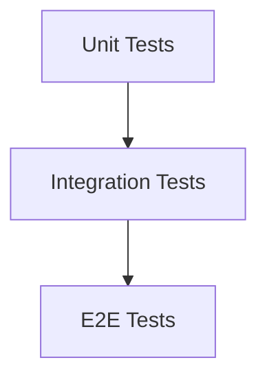

# 🧪 テスト戦略

## 現状

- テスト用ディレクトリ/ファイルはリポジトリ内に存在しません。
- 品質確認は手動のスモークテストとログ確認が中心です。

## 目標テスト構成（推奨）



## 重点テスト領域

### 1. API バリデーション
- `/api/course-reviews` の入力チェックと DB 制約の整合性。
- `/api/company-reviews` の outcome/selection_types のチェック。

```ts
if (form.academicYear < 1990 || form.academicYear > 2100) return false; // 年度の範囲チェック
```
(参照: apps/review-page/app/course_reviews/page.tsx:415-416)

### 2. AI判定フロー
- `/api/review-moderation` の JSON 形式パースが失敗した場合の fallback。

```ts
try {
  parsed = JSON.parse(outputText);
} catch {
  parsed = null; // JSON 失敗時は null 扱い
}
```
(参照: apps/review-page/app/api/review-moderation/route.ts:114-120)

### 3. バッチ処理
- `embedding_jobs` のロック処理とリトライ。

```ts
const staleBefore = new Date(Date.now() - LOCK_STALE_MINUTES * 60 * 1000).toISOString(); // stale ロック
```
(参照: apps/review-page/app/api/batch/embeddings/run/route.ts:116)

## テスト実施の入口

- lint: `npm run lint`
- 手動スモーク: LINE → 返信、フォーム投稿 → DB 反映、subject-browser の検索

```jsonc
{
  "scripts": {
    "lint": "next lint" // 静的解析
  }
}
```
(参照: apps/review-page/package.json:5-10)

次に進む場合は [デプロイメント](./09-デプロイメント.md) を参照してください。
