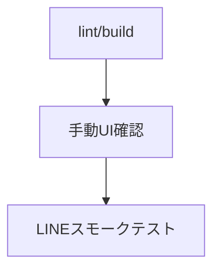

# ✅ テスト戦略

## 方針

- review-page は Next.js の `lint`/`build` をベースに、画面の手動確認を併用します。(apps/review-page/package.json:6-10)
- LINE Webhook はスモークテストでエンドポイントの応答とLINE経由の返答を確認します。(report.md:52-55)

## テストフロー



## 代表スクリプト

```jsonc
{
  "scripts": {
    "lint": "next lint", // 静的解析
    "build": "next build", // 本番ビルド
    "start": "next start" // 本番起動
  }
}
```
(参照: apps/review-page/package.json:6-9)

## スモークテスト例

- `GET https://line-liart.vercel.app/api/webhook` が `LINE Bot running` を返す。(report.md:52-54)
- LINE からメッセージを送って返信を確認。(report.md:52-54)

次に進む場合は [デプロイメント](./09-デプロイメント.md) を参照してください。
