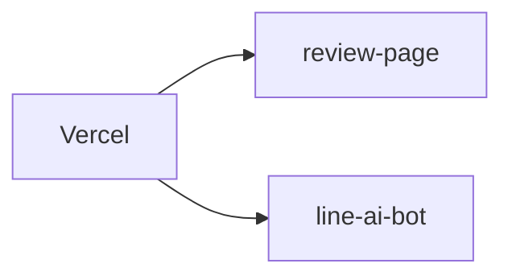

# 🚢 デプロイメント

## Vercel 構成

- review 側: `apps/review-page` (production: `https://campus-ai-eight.vercel.app`)。(report.md:13-17)
- line 側: `apps/line-ai-bot` (production: `https://line-liart.vercel.app`)。(report.md:17-18)



## LINE Webhook の Vercel 設定

```jsonc
{
  "builds": [{ "src": "api/webhook.js", "use": "@vercel/node" }], // Nodeビルド
  "routes": [{ "src": "/api/webhook", "dest": "api/webhook.js" }] // Webhookルート
}
```
(参照: apps/line-ai-bot/vercel.json:1-4)

## GitHub Actions（バッチ実行）

```yaml
on:
  schedule:
    - cron: '*/10 * * * *' # 定期実行
  workflow_dispatch: {} # 手動実行
```
(参照: .github/workflows/batch-jobs.yml:3-6)

次に進む場合は [コントリビューションガイド](./10-コントリビューションガイド.md) を参照してください。
