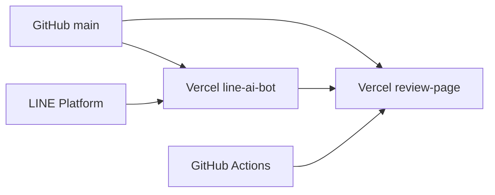

# 🌐 09. デプロイメント

## 9.1 配置方針

- Vercel Project A: `apps/review-page`
- Vercel Project B: `apps/line-ai-bot`
- 任意で Vercel Project C: `apps/subject-browser`

`line-ai-bot` は `ASK_REVIEW_API_URL` / `ASK_COMPANY_API_URL` 経由で Project A に接続します。

(参照: `../apps/line-ai-bot/api/webhook.js:491-505`、`../apps/line-ai-bot/vercel.json:1-4`)

## 9.2 必須環境変数（要点）

### review-page

- `SUPABASE_URL`
- `SUPABASE_SERVICE_ROLE_KEY`
- `OPENAI_API_KEY`
- `LINE_HASH_PEPPER`
- `NEXT_PUBLIC_LIFF_ID`
- `NEXT_PUBLIC_LIFF_ID_COMPANY`
- `BATCH_TOKEN`

### line-ai-bot

- `SUPABASE_URL`
- `SUPABASE_SERVICE_ROLE_KEY`
- `LINE_CHANNEL_SECRET`
- `LINE_CHANNEL_ACCESS_TOKEN`
- `OPENAI_API_KEY`
- `ASK_REVIEW_API_URL`
- `ASK_COMPANY_API_URL`

(参照: `../apps/review-page/.env.example:1-25`、`../apps/line-ai-bot/.env.example:1-24`)

## 9.3 LINE 設定

- Webhook URL: `https://<line-ai-bot-domain>/api/webhook`
- チャネルアクセストークンとシークレットを `line-ai-bot` 側に設定
- LIFF ID は `review-page` 側の `NEXT_PUBLIC_LIFF_ID*` と一致させる

## 9.4 バッチ運用

GitHub Actions が 10 分おきに実行:

- `/api/batch/embeddings/run`
- `/api/batch/rollups/run`

(参照: `../.github/workflows/batch-jobs.yml:3-35`)

## 9.5 デプロイ図


```mermaid
flowchart LR
  Dev[GitHub main]
  V1[Vercel review-page]
  V2[Vercel line-ai-bot]
  LINE[LINE Platform]
  GH[GitHub Actions]

  Dev --> V1
  Dev --> V2
  LINE --> V2
  V2 --> V1
  GH --> V1
```

## 9.6 コードスニペット（バッチ実行）

```yaml
# .github/workflows/batch-jobs.yml:16-33
- name: Run embeddings batch
  run: |
    curl -sS -X POST "$REVIEW_BASE_URL/api/batch/embeddings/run" \
      -H "x-batch-token: $BATCH_TOKEN" \
      -H "x-batch-runner: github-actions" \
      --data '{}' \
      --fail
```

## 9.7 リリース前チェック

1. review-page の `NEXT_PUBLIC_LIFF_ID*` が正しいか
2. line-ai-bot の `ASK_REVIEW_API_URL` が review-page の `/api/review-ask` を指すか
3. `BATCH_TOKEN` が review-page と GitHub Secrets で一致しているか
4. `/api/review-ask` に `x-ask-debug: 1` で疎通確認できるか

## 9.8 関連ページ

- 起動手順: [02. クイックスタート](./02-クイックスタート.md)
- 問題点: [11. まとめ](./11-まとめ.md)
