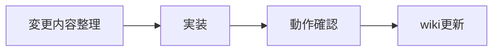

# 🤝 コントリビューションガイド

## 開発方針

- 既存の API/DB 制約に合わせる（DB CHECK 制約のズレは 400 で落ちる）。
- LINE userId は常に HMAC でハッシュ化する。
- DB 参照が必要な質問は必ず tools を通す。

```ts
const LINE_HASH_PEPPER = requireEnv('LINE_HASH_PEPPER', process.env.LINE_HASH_PEPPER); // pepper 必須
```
(参照: apps/review-page/app/api/ask/route.ts:28-30)

## ローカル開発

- review-page: `npm run dev`
- subject-browser: `npm run dev`
- line-ai-bot: `npm run start`

```jsonc
{
  "scripts": {
    "dev": "next dev", // Next.js 開発
    "start": "node api/webhook.js" // webhook 起動
  }
}
```
(参照: apps/review-page/package.json:5-8, apps/line-ai-bot/package.json:8-10)

## コーディング規約（最低限）

- API ルートでは `supabaseAdmin` を使用し、RLS を意識する。
- エラーハンドリングは JSON で返す（`supabaseErrorToJson` パターン）。

```ts
function supabaseErrorToJson(err: any) {
  if (!err) return null;
  return { message: err.message, code: err.code, details: err.details, hint: err.hint };
}
```
(参照: apps/review-page/app/api/ask/route.ts:278-281)

## ドキュメント更新

- `wiki/` を必ず更新する。
- 既存の構成・命名を維持し、ページ間リンクを追加する。

## 変更提案の手順



次に進む場合は [まとめ](./11-まとめ.md) を参照してください。
