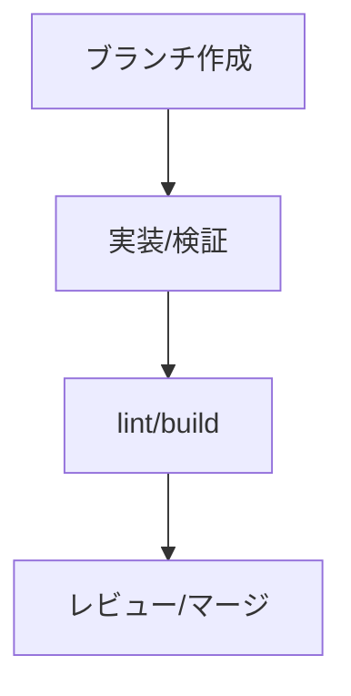

# 🤝 コントリビューションガイド

## 開発ルール

- review 側は Next.js を利用するため、`npm run dev` / `npm run lint` を基本に進めます。(apps/review-page/package.json:5-10)
- line 側は `node api/webhook.js` のみで起動します。(apps/line-ai-bot/package.json:8-10)

## 作業フロー



## 代表コマンド

```jsonc
{
  "scripts": {
    "dev": "next dev", // 開発サーバー
    "lint": "next lint" // 静的解析
  }
}
```
(参照: apps/review-page/package.json:5-9)

## PR 作成時の注意

- DBに影響がある場合は [データモデル](./05-データモデル.md) も更新してください。
- API 変更がある場合は [APIドキュメント](./07-APIドキュメント.md) に追記してください。

次に進む場合は [まとめ](./11-まとめ.md) を参照してください。
