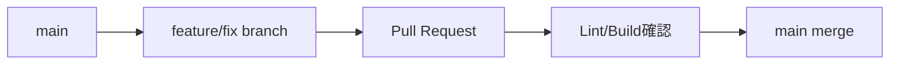

# 🤝 10. コントリビューションガイド

## 10.1 ブランチ運用

- `main`: 本番反映対象
- 作業ブランチ: `feature/*`, `fix/*`, `docs/*`
- 1機能1PRを原則にし、DB変更はSQLとコードを同一PRで管理

## 10.2 変更の基本方針

- API仕様変更時は `wiki/07-APIドキュメント.md` を同時更新
- スキーマ変更時は `wiki/05-データモデル.md` と SQL を同時更新
- UI必須項目変更時は
  - `app/course_reviews/page.tsx`
  - `app/api/course-reviews/route.ts`
  - `subject_rollups` バッチ（必要時）
  をセットで確認

## 10.3 ローカル確認フロー

```bash
# review-page
cd apps/review-page
npm run lint
npm run build

# subject-browser
cd ../subject-browser
npm run lint
npm run build
```

## 10.4 DB変更の運用

- 破壊的変更（DROP/型変更）は原則リリース後半まで避ける
- 先に「追加」で吸収し、アプリ移行後に削除
- タグ機能は中間テーブル方式（`review_tags`, `course_review_tags`）を維持

(参照: `./ddl-test.sql:296-318`)

## 10.5 レビュー観点

- ハッシュタグ検索の大学補完が壊れていないか
- `ASK_REVIEW_API_URL` と `ASK_API_URL` の優先順が意図通りか
- `review-ask` の tool schema が strict 要件を満たすか
- LIFF ID 参照が `NEXT_PUBLIC_*` で統一されているか

(参照: `../apps/line-ai-bot/api/webhook.js:491-503`、`../apps/review-page/app/api/review-ask/route.ts:515-520`)

## 10.6 Gitフロー図


```mermaid
flowchart LR
  M[main] --> F[feature/fix branch]
  F --> PR[Pull Request]
  PR --> CI[Lint/Build確認]
  CI --> M2[main merge]
```

## 10.7 コードスニペット（最小コミット単位）

```bash
# 例: タグ検索修正の最小単位
git add apps/review-page/app/api/review-ask/route.ts
git add apps/line-ai-bot/api/webhook.js
git add wiki/07-APIドキュメント.md
git commit -m "fix: hashtag search university fallback and docs"
```

## 10.8 関連ページ

- 品質保証: [08. テスト戦略](./08-テスト戦略.md)
- 最終確認: [11. まとめ](./11-まとめ.md)
