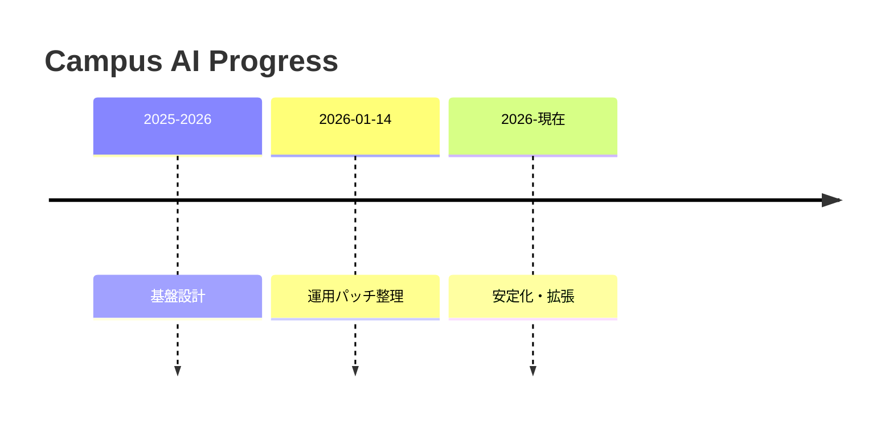

# ✅ まとめ

## 成果の要約

- LINE + LIFF + Supabase + OpenAI を組み合わせたレビュー/QAシステムを構築。
- 授業レビューと企業レビューを同一基盤で管理し、集計と要約を自動化。
- バッチで embedding と rollup を分離し、API応答時間の肥大化を防ぐ設計。

## できていること

- 授業レビュー投稿のバリデーションと DB upsert。
- 企業レビュー投稿と会社サジェスト。
- QA（授業/企業）の tool-based DB検索。
- AI による不適切レビュー検知。

```ts
const { data: jobs } = await supabaseAdmin
  .from('embedding_jobs')
  .select('review_id,status,attempt_count,locked_at,locked_by'); // 埋め込みジョブ取得
```
(参照: apps/review-page/app/api/batch/embeddings/run/route.ts:118-121)

## 課題と今後の展望

- **検索精度**: rollup/embedding の更新頻度や summary の品質向上が必要。
- **評価軸の拡張**: 企業レビューの指標や UI 表示の改善。
- **運用安定化**: `ASK_DEBUG` の可視化強化や障害検知の追加。

(参照: report.md:25-27)

## 進行の見取り図



## 次の一歩

- テストの自動化
- RLS ポリシーと監査ログの整備
- 管理者向けUIの追加

(参照: report.md:96-106)
