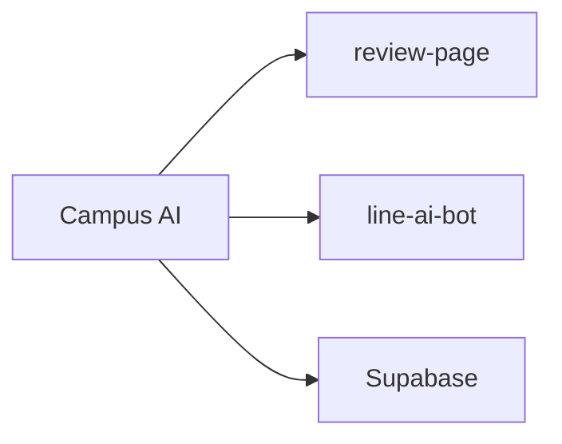

# ✅ まとめ

## まとめ

- Campus AI は LINE/LIFF と Supabase を中心にした大学レビュー/QAシステムです。(report.md:77-78)
- review-page と line-ai-bot の2プロジェクト構成で運用します。(report.md:13-18)



## 参考スニペット（レビュー本文）

```sql
CREATE TABLE public.course_reviews (
  id uuid NOT NULL DEFAULT gen_random_uuid(), -- 主キー
  user_id uuid NOT NULL,                      -- users.id
  subject_id uuid NOT NULL,                   -- subjects.id
  body_main text NOT NULL,                    -- 本文
  CONSTRAINT course_reviews_pkey PRIMARY KEY (id)
);
```
(参照: report.md:361-386)

次のアクションは [目次](./00-目次.md) を参照してください。
