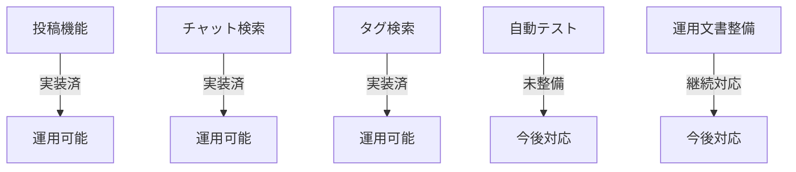

# ✅ 11. まとめ

## 11.1 現在の到達点

- 授業レビュー投稿、企業レビュー投稿、LINEチャット検索、タグ検索の基本機能は実装済み
- tool calling により、DB根拠の回答に寄せる実装になっている
- バッチ（埋め込み/rollup）と定期実行（GitHub Actions）が接続済み

(参照: `../apps/review-page/app/api/review-ask/route.ts:1345-1477`、`../.github/workflows/batch-jobs.yml:1-35`)

## 11.2 現在の残課題（優先順）

### 1) 自動テスト未整備

- unit / integration / e2e が未整備で、回帰確認は手動中心

### 2) `report.md` と実装の差分

- 旧設計メモが残っており、最新運用とは記載差分がある

### 対応済み（今回の修正）

- `/api/ask` を `/api/review-ask` の再エクスポートに変更し、重複ロジックを解消
- `search_subjects_by_name` の大学補完差分を解消（`/api/ask` 側）
- Webhook の URL ログ重複を解消
- `companies/suggest` に `force-dynamic` を追加
- ルート README の構成に `subject-browser` を追記
- 追跡不要のログダンプファイルを削除
- `apps/line-ai-bot/index.js` を削除し、実運用エントリポイントを `api/webhook.js` に一本化

## 11.3 発表前チェックリスト

1. LINE 実機で `#高難易度` が期待件数で返るか
2. `ASK_REVIEW_API_URL` が `/api/review-ask` を指しているか
3. `review-page` / `line-ai-bot` の本番環境変数を再確認したか
4. `x-ask-debug: 1` で tool 呼び出し履歴を確認したか

## 11.4 全体ステータス図


```mermaid
flowchart TD
  A[投稿機能] -->|実装済| OK1[運用可能]
  B[チャット検索] -->|実装済| OK2[運用可能]
  C[タグ検索] -->|実装済| OK3[運用可能]
  D[自動テスト] -->|未整備| TODO1[今後対応]
  E[運用文書整備] -->|継続対応| TODO2[今後対応]
```

## 11.5 コードスニペット（ask一本化）

```ts
// apps/review-page/app/api/ask/route.ts:1-3
export { runtime, dynamic, POST } from '../review-ask/route';
```

## 11.6 関連ページ

- API確認: [07. APIドキュメント](./07-APIドキュメント.md)
- 運用確認: [09. デプロイメント](./09-デプロイメント.md)
